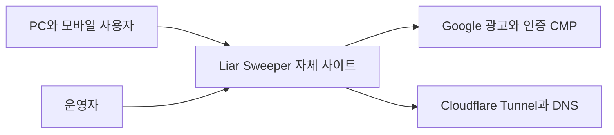
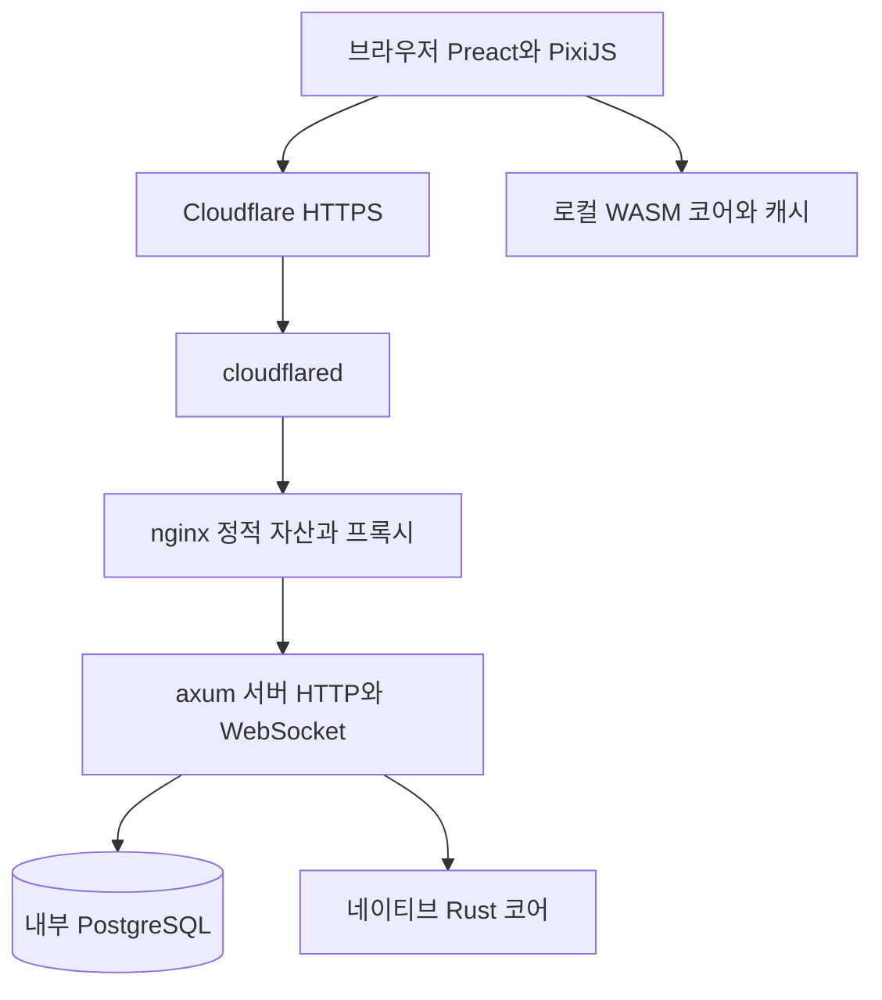
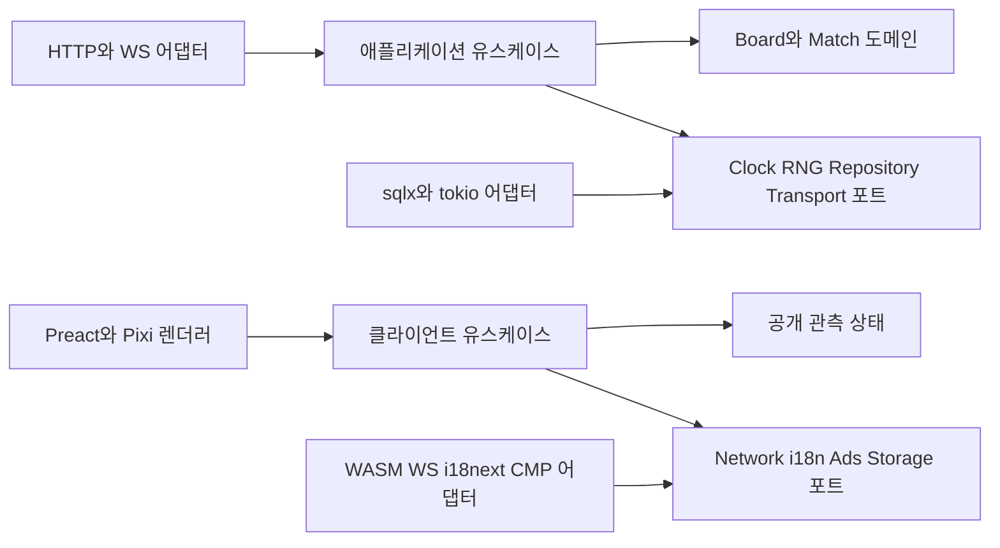

# 01. 시스템 아키텍처

> 설계 초안 · 대응: FR01~16, NFR01/02/07 · [PRD](../product/16-PRD.md)

## C4: 시스템 컨텍스트

사용자는 사이트와 광고 제공자에 접근한다. 운영자는 가정 미니 PC를 관리한다. 게임의 규칙·기록 저장은 자체 서버에 있고 외부 결제·분석·클라우드 게임 서버는 없다.

## C4: 컨테이너

HTTP/WS는 동일 origin에서 제공한다. 온라인 정답은 서버만 보유한다. WASM은 공개 데일리·로컬 봇 규칙을 실행하며 온라인 숨은 판을 재생성할 자료를 받지 않는다. 오프라인과 온라인 데이터를 타입 수준에서 구분한다.

## C4: 컴포넌트와 의존성

도메인은 시간·DB·WebSocket·렌더러를 import하지 않는다. 애플리케이션이 도메인과 추상 포트를 사용하고 composition root가 구현체를 주입한다. Rust의 trait, TypeScript의 interface/서비스로 의존성 역전을 구현한다. 계층의 호출 흐름과 소스 의존 방향을 혼동하지 않는다.

## 프로세스 경계

서버는 하나의 프로세스, 매치당 직렬 mailbox로 명령을 처리한다. 생성/증명은 bounded blocking pool에 격리하고 미리 검증한 판을 풀로 준비한다. DB는 매 클릭 경로 밖에서 결과를 transaction으로 저장한다. 연결 수·큐·매치 수에 상한을 두며 부하 초과 시 새 입장을 거절한다.

설정·도메인·프로토콜 타입의 원천은 Rust다. 클라이언트 온라인 코드는 시각·입력만 담당하고 승패를 예측해서 확정하지 않는다. 도메인 오류는 안정된 code로 전달하고 문구 번역은 클라이언트가 한다.
