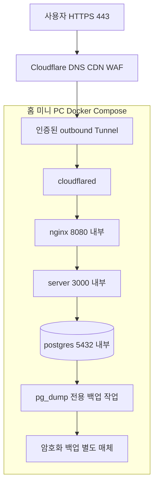

# 02. 배포와 네트워크

> 대응: FR10/16, NFR02/07 · 배포 설정은 M5에서 구현한다.

Tunnel은 origin에 공개 IP를 부여하지 않고 outbound 연결을 만든다. 집 IP와 origin DNS를 공개하지 않고 라우터 포트포워딩을 설정하지 않는다. [Cloudflare 공식 문서](https://developers.cloudflare.com/cloudflare-one/networks/connectors/cloudflare-tunnel/)

## 네트워크와 포트

| 네트워크 | 연결 컨테이너 | host 포트 |
|---|---|---|
| edge | cloudflared, nginx | 없음 |
| app: internal | nginx, server | 없음 |
| db: internal | server, postgres, 백업 작업 | 없음 |
| 운영 접근 | 로컬 SSH 또는 사용자 VPN | 게임 배포에서 추가 공개하지 않음 |

nginx는 정적 자산과 `/api/`, `/ws`만 프록시한다. 실제 client IP는 trusted proxy 경로에서만 해석하며 사용자가 보낸 헤더를 신뢰하지 않는다. CDN은 hash 자산만 장기 캐시, WS/API/닉네임·순위 응답은 cache bypass, HTML은 짧은 재검증을 사용한다. cloudflared egress는 공식 Tunnel 연결 요구사항을 운영 환경에서 확인한다. WAF 기능과 무료 한도는 사용 중 플랜에서 검증하며 유료 플랜을 전제로 하지 않는다.

## 저장소와 비밀

PostgreSQL 데이터는 전용 볼륨, 앱은 non-root/read-only rootfs, 임시 파일은 제한된 tmpfs를 제안한다. DB 비밀번호·Tunnel 토큰은 host의 권한 제한 파일/Compose secret으로 전달하고 저장소에 넣지 않는다. 개발용 DB를 인터넷에 바인딩하지 않는다.

## 장애와 백업

인터넷·전원 장애 시 새 온라인 매치를 시작하지 않는다. 이미 캐시된 클라이언트는 별도 로컬 봇/데일리 연습을 제공한다. 서버 재시작 시 진행 매치는 abort로 복구하고 승패·광고 카운트에 포함하지 않는다. 매일 pg_dump와 별도 매체 복사, 월1회 복구 검증을 수행한다. [DB](07-database.md), [운영 절차](16-observability-ops.md)를 따른다.

RPO≤24시간·RTO≤2시간은 운영 목표다. 전원·회선·장비가 없으면 달성 보장하지 않는다. 초기 미니 PC OS·CPU/RAM·업로드 속도·회선 약관은 운영자 확인 사항이다.
