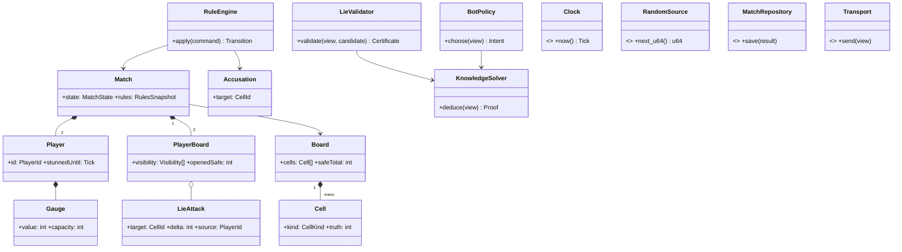

# 03. 도메인 모델과 단일 책임

> 대응: FR02~06/15, NFR01 · 모든 도메인 식별자는 영어다.

| Rust struct / trait | 단일 책임 | 입력·출력 / 불변식 |
|---|---|---|
| Board, Cell | 불변 정답과 인접 수 보관 | 생성 후 지뢰/숫자 변경 없음, 서버 비밀 |
| PlayerBoard | 개인 공개 상태 관리 | 정답 소유 없음, 열린 상태 단조 증가 |
| Match | 매치 생명주기와 결과 | 승패 종료 1회, 두 플레이어 분리 |
| Player | 참여자와 제재 상태 | 기절 deadline, 신원만 |
| Gauge | 제한된 자원 계산 | 0≤value≤capacity |
| LieAttack | 대상·출처·변형 값·증거 식별 | 셀당1, 플레이어당≤2 |
| Accusation | 지목 의도 | 관측 숫자 셀만 대상으로 함 |
| RuleEngine | 규칙 전이 계산 | IO 없음, 명령→새 상태/도메인 이벤트 |
| KnowledgeSolver | 관측으로 참인 추론과 증명 | 숨은 정답 읽기 금지 |
| BoardGenerator | 검증된 Board 생성 | RNG·budget·opening→판/증거 |
| LieValidator | 후보의 안전한 간파 경로 검증 | 관측 기반 증명, 예산 초과시 거절 |
| BotPolicy | 관측 기반 의사결정 | solver와 fake clock 입력, 진실 접근 없음 |
| RulesSnapshot | 튜닝 불변 버전 | match 시작 hash 고정 |

Clock, RandomSource, MatchRepository, AccountRepository, AuthIdentityRepository, SessionRepository, OAuthProvider, CredentialVault, DailyRepository, Transport는 애플리케이션 포트다. SystemClock, SeededRng, SqlxRepositories, WsTransport는 인프라 어댑터다. 보드 생성의 난수와 계정 토큰 생성의 암호학적 난수는 별도 구현체로 분리한다.

온라인 SnapshotProjection은 애플리케이션에서 비밀 필드를 제거한다. 인증·DB 저장·매칭·광고는 RuleEngine 책임 밖이다. Player/Match에 네트워크 핸들이나 sqlx 타입을 넣지 않는다.
