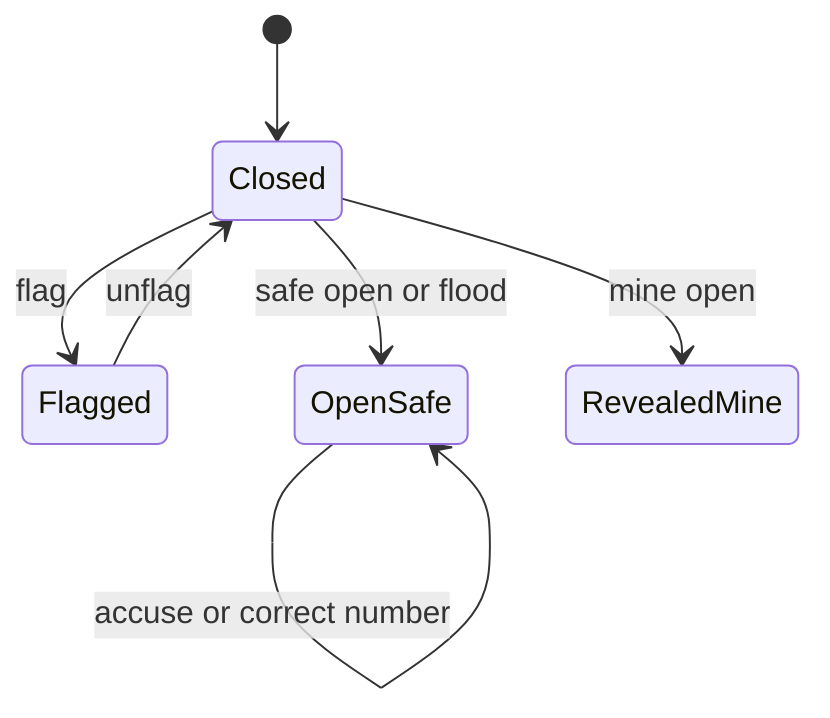
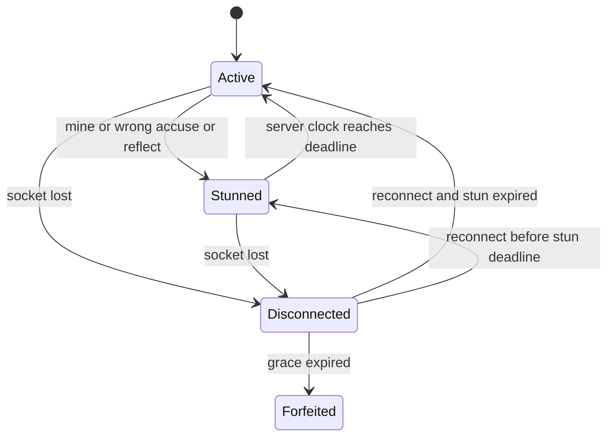
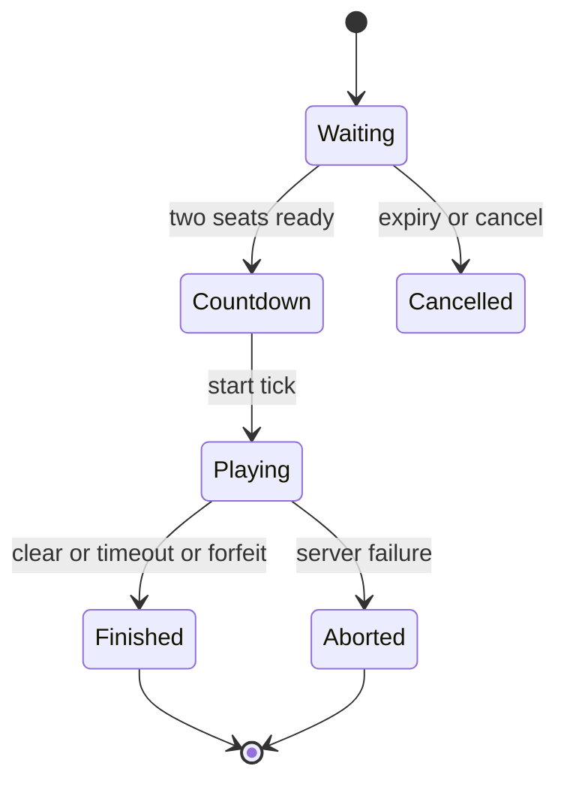

# 04. 게임 규칙 정식 명세 초안

> 대응: FR02~08/14/15 · 아래 추가 튜닝/엣지 규칙은 사용자 승인 대상이다.

## 설정 원천

M1에서 `config/game-rules.toml` 하나를 만들고 Rust RulesSnapshot으로 로드·검증한다. UI와 WASM은 이 snapshot의 공개 필드를 사용하며 TS에 규칙 숫자를 재정의하지 않는다.

| 항목 | 기본 제안 |
|---|---|
| board / mines | 16×16 / 40, safeTotal=216 |
| duration / countdown | 240,000ms / 3,000ms |
| mine stun / wrong accusation / reflected stun | 3,000 / 3,000 / 2,000ms |
| gauge capacity / safe-cell gain | 20 / 1, flood의 새 안전칸도 각각 +1 |
| active lies | 최대2, 숨김/공개 모두 포함 |
| reconnect grace / private room expiry | 30,000ms / 600,000ms |

## 초기 상태와 보드

같은 시드·규칙·고정 시작 좌표로 만든 동일 Board를 개인 PlayerBoard 두 개에 연결한다. 서버가 검증된 zero opening을 둘 모두에게 자동 공개한다. 시작 영역은 게이지를 주지 않는다. 서로 다른 첫 클릭으로 판을 재생성하지 않는다. 생성 RNG/solver/rules 버전을 저장한다. 온라인 시드·지뢰·보드 hash로 역추정 가능한 정보는 클라이언트로 전송하지 않는다.

Lie는 visibility와 별도의 overlay다. Flag는 사용자의 메모이며 solver가 참으로 취급하지 않는다. Flagged 셀 open은 거절하고 먼저 unflag한다. chord 일괄 열기는 MVP에서 제공하지 않는다. 0 flood는 flag 셀을 건너뛰며 새 안전칸만 한 번 계산한다. 지뢰 공개는 진행률/게이지에 기여하지 않는다.

연속 기절은 `max(기존 deadline, 현재 tick+새 기간)`으로 계산한다. 기절 중 open/flag/attack/accuse는 거절하고 상태 동기화·연결 유지 명령은 허용한다. 끊김과 기절은 저장 필드로는 독립 상태다.

## 공격과 지목

공격은 준비 게이지를 사용자가 버튼으로 발동한다. 숨은 상대 판을 보여주지 않고 서버가 닫힌 비제로·비중복 숫자 중 검증된 후보를 결정론적으로 선택한다. truth=1이면 +1만, truth=8이면 −1만, 그 외 ±1; displayed는 1~8. 0·공개 숫자·이미 변형된 셀은 제외한다. 안전 간파 증명이 없거나 최대2면 거절, 게이지는 보존한다. 성공시 게이지 0, 공격 출처를 서버에 보존한다.

첫 후보 전략은 [ADR0010](../adr/0010-public-certified-attack-strategy.md)의 `known-neighborhood-v1`이다. 공개 관측 이력으로 이미 safe와 모든 이웃 상태를 증명한 닫힌 셀만 등록한다. 이 공개 선택 제한도 합법적인 숨은 세계의 조건이다. 등록 목록·공격 시점·위치·개수를 공개하지 않으며 원래 숫자의 추론은 정답 Board 없이 수행한다.

열린 실제 lie를 지목하면 truth로 복원하고 overlay 제거, 공격자 게이지0·2초 기절. 정상 숫자를 지목하면 본인3초 기절. 같은 command 재전송은 같은 응답, 다른 command로 이미 수정된 셀 재지목은 정상 숫자 오지목이다. 시스템은 지목 전 셀의 거짓 여부를 알려주지 않는다. 짧은 분위기 경고는 고정 주기의 양쪽 공통 연출이며 성공한 공격 시점·위치와 연결하지 않는다. 핸드오프의 경고/비인지 표현 충돌을 이렇게 해석한 제안이다.

## 순서와 종료

서버가 입장시 고정한 seat와 ingress monotonic timestamp, server_seq로 입력을 직렬화한다. 수신 시간이 deadline 이상인 명령은 종료 판정 뒤 거절한다. 수신 timestamp 동률은 seat 순서+sequence로 결정하며 이는 네트워크 레이스 동률 처리일 뿐 물리적으로 동시에 클릭한 시간을 알 수 없다.

각 명령은 검증→한 번의 상태 전이→안전칸 완료 검사→결과 확정→공개 delta 순이다. 먼저 commit된 전체 안전칸 완료가 승리하며 이후 공격/지목은 거절한다. 240초 만료 시 openedSafe/216 비교, 동률 무승부(오류·지목 수로 타이브레이크 없음). 결과는 idempotent transaction 한 번으로 저장한다.

한 사람 30초 끊김은 패배; 둘 다 유예 만료면 abandon 무승부. 서버 재시작/운영 장애는 abort이며 순위·광고 완료 카운트에 넣지 않는다. 재접속 동안 시간은 계속 흐른다. 온라인 매치를 로컬 봇으로 바꾸지 않는다. 매칭 후 시작 전 끊김은 취소하고 상대에게 재대기 선택을 제공한다.
