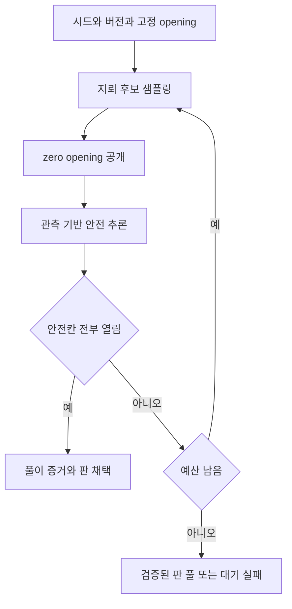
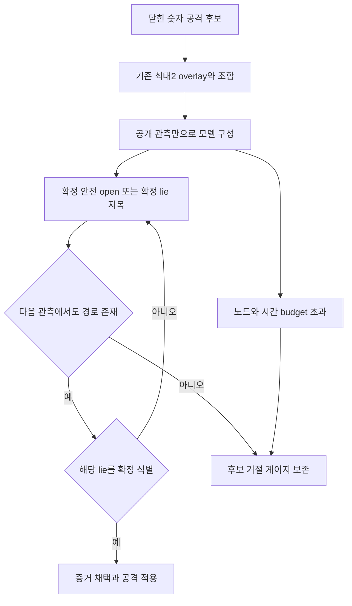

# 05. 생성·추론·간파·봇 알고리즘

> 대응: FR02/04/06, NFR04 · 생성과 공개 후보 전략의 실행 결과는 [#5](../verification/05-generation-solver.md)·[#6](../verification/06-lie-certification.md)에 기록했다. 전체 출시·재미·실호스트 검증은 남아 있다.

## 결정론과 노게스 생성

입력은 server secret seed, rng_version, solver_version, RulesSnapshot, 고정 opening이다. Rust native/WASM에서 정수 연산과 고정 순회 순서만 사용한다. hash/표준 컬렉션의 비결정 순회와 wall clock을 규칙 결과에 사용하지 않는다.

zero opening 주변을 안전하게 생성하고 인접 숫자를 O(N) 계산한다. 단일 숫자 규칙(남은 mine=0 또는 남은 cell 수), 부분집합 차분, 연결 frontier의 제한된 완전 탐색을 사용한다. 정답은 생성 후 실제 안전성 대조에만 사용하고 추론 단계에는 제공하지 않는다. no-guess=명시된 solver가 안전한 칸을 증명하는 경로가 존재함이며 모든 클릭이 안전하다는 뜻은 아니다.

### #5 구현 계약

`BoardSpec`은 최대256셀, 유효한 mine 수·opening을 검증한다. 기본 판은 16×16/40, opening은 좌상단 cell0이며 주변8칸 범위에는 지뢰를 두지 않는다. `Board`의 정답은 private이고 Serialize/Debug를 구현하지 않는다. `Observation`은 Unknown/공개 숫자/실제 공개 지뢰만 가진다. 사용자 flag는 Unknown으로 투영한다.

`NoGuessSolver`는 truth-only 제약을 푸는 solver다. 거짓말 없는 생성 인증과 공개 후보 전략으로 truth임을 증명한 논리 관측에만 사용한다. 온라인의 raw 화면 숫자에 그대로 적용하지 않는다. 일반 노게스 성공과 제한 없는 최대2lie 모델의 성공을 구분한다.

solver는 관측 숫자의 인접 제약과 전체 mine 수에서 직접/부분집합 추론을 적용한다. 진행이 없으면 인접 제약으로 연결된 frontier를 나누고, 각 구성요소의 모든 모델을 제한된 DFS로 열거한다. 구성요소별 mine 수와 frontier 밖 칸 수를 전체 mine 수에 결합한다. 유효한 **모든** 모델에서 같은 값을 갖는 칸만 반환한다. 탐색 중 얻은 일부 모델로 안전을 선언하지 않는다. 노드/구성요소 크기/제약 수 상한 초과는 BudgetExceeded이며 생성기를 통과하지 못한다.

RNG v1은 명시된 SplitMix64 정수 wrapping 연산과 rejection sampling의 Fisher–Yates 순회다. 플랫폼 표준 RNG, hash map 순회, 부동소수점, 시각을 사용하지 않는다. 생성은 고정 후보 수 상한 안에서 샘플→zero flood→증명된 안전칸만 열기→전체 safeTotal 완료를 반복한다. 증거에는 RNG/solver 버전·후보 번호·각 단계의 안전칸/확정 지뢰·추론 종류를 보관하고 재검증한다. 증거/시드는 online public DTO에 넣지 않는다.

TS03의 작은 판 전수 검사는 독립적으로 가능한 지뢰 배치를 열거해 모든 관측 부분집합에서 반환된 안전/지뢰 결론을 대조한다. 생성 벤치는 release 10,000개 seed의 성공/실패·시도 수·p50/p95/max를 기록한다. 개발 PC의 결과를 미니 PC 용량 또는 #6 간파 비용으로 표현하지 않는다.

## 거짓말을 아는 추론과 간파 증명

단순히 전체 정답을 보고 “나중에 모순이 난다”는 조건은 불충분하다. 플레이어가 모르는 정답으로만 모순을 찾는 검사는 금지한다.

관측 K에서 지뢰 배치 M과 열린 숫자별 lie 변수 L을 함께 고려한다. 전체 mine 수, 공개 mine/zero, 숫자 1~8, 변화 ±1, 동시에 최대2라는 공개 규칙을 제약으로 사용한다. 사용자 flag는 증거가 아니다. 가능한 모델 집합 C(K)에서 **모든 모델이 안전**이라 판단한 칸만 안전 추론, **모든 모델이 특정 열린 숫자를 lie**라 판단하면 확정 지목이다.

숨은 lie의 위치와 정확한 활성 개수는 공개되지 않는다. 따라서 “지금은 공격이 없으니 모든 숫자가 참”이라는 서버만 아는 사실을 추론에 사용하지 않는다. 정상 노게스 판도 lie 가능성을 허용한 관측에서는 막힐 수 있다. **이 추가 조건이 현실적으로 생성 가능한지는 A4의 핵심 미검증 가정**이다. 원래 노게스 기준과 대전 간파 기준을 각각 통과해야 하며 못 통과하면 온라인 공격 대전을 출시하지 않는다.

증거는 안전 행동→가능한 관측 결과→후속 증명의 AND/OR tree다. 숨은 정답 하나에서만 성공하는 경로를 합격시키지 않는다. 탐색 가능한 모든 관측 분기에서 안전 진행과 후보 lie 식별 경로를 요구한다. 기존 lie가 있다면 동시 조합을 검증한다. 새 open/flag/accuse로 상태가 변할 때 이미 유지 중인 overlay의 안전 경로가 보존되는지도 검증하며 새 공격이 이를 깨면 거절한다. 공개 관측을 공유하는 여러 숨은 세계를 구별하지 못하면 확정 지목으로 인정하지 않는다.

증명 표현은 rules/solver version, 공개 상태 fingerprint, 안전칸 집합, lie 식별 근거, 검증 노드 수다. 증명·후보 위치·숨은 판은 온라인 응답에 넣지 않는다. 초기 설명용 튜토리얼의 알려진 공격 위치는 별도 연습 데이터다.

### #6 구현 계약과 보수적인 증명

`KnowledgeSolver`는 공개 Observation과 공개 정보에서 이미 증명한 KnowledgeMemory만 받는다. 모든 미교정 비제로 숫자는 truth 또는 ±1 lie일 수 있고 visible lie 수는0~2다. zero·지목 결과로 확인한 truth는 고정한다. flag는 증명된 mine과 별개다. 가능한 mine 배치·lie 여부를 연결 frontier에서 완전히 열거하고 구성요소의 mine 수/lie 수를 전체 mine 수·최대2에 결합한다. 직접적인 범위/전체 mine 수 추론도 허용하지만 일부 모델을 근거로 안전/lie를 반환하지 않는다.

자동 zero opening은 공격 입력을 받기 전에 공개된다. opening의 연결된 zero 영역과 경계 숫자는 공개 진행 순서로 truth임을 알 수 있고, 이미 열린 셀은 이후 공격할 수 없다. `KnowledgeMemory::from_initial_opening`은 그 연결 영역만 추적해 trusted로 기록한다. 현재 snapshot의 다른 열린 숫자는 이 이유로 신뢰하지 않는다. 이를 서버만 아는 “아직 공격이 없다”라는 가정과 구분한다. 무출처 관측의 `new`는 모든 비제로 숫자에 최대2 lie를 허용한다.

정답 배치는 변하지 않으므로 한 번 증명한 safe/mine 사실은 지목으로 숫자가 복원되거나 새 닫힌 공격이 생겨도 유지된다. PlayerBoard마다 새 memory를 만들고 관측 기반 증거만 흡수한다. 교정/오지목으로 확인한 열린 truth는 다시 공격할 수 없어 trusted clue로 기록한다. 사용자 flag나 숨은 Board를 memory에 넣지 않는다.

초기 LieValidator는 일반적인 깊은 AND/OR 탐색을 통과했다고 주장하지 않는다. **닫힌 후보가 모든 모델에서 safe이고 모든 이웃의 mine/safe 상태도 확정**이면 정확한 truth를 공개 정보로 계산할 수 있다. 비제로±1 변형을 적용한 후보를 안전하게 open하면 가능한 모든 후보 관측 분기에서 이웃 mine 수와 불일치해 해당 lie가 확정된다. 이것은 AND/OR 증명의 깊이2 특수형이며, fixed delta의 모든 가능한 모델에서 동일한 관측값을 얻는 것을 증명한다. 조건을 충족하지 않는 다른 후보는 거절한다. 후보 범위를 좁힌 선택 전략이며 보드/게이지/공격 규칙을 바꾸지 않는다.

이 증명은 기존 overlay의 위치/개수를 추론에 제공하지 않고 최대2를 항상 허용하므로 두 overlay 조합에 적용한다. 서버의 active count는 용량 거절에만 사용한다. 추가/교정/열기에 따른 상태 변경은 memory의 확정 사실을 유지하고 새 준비 결과를 현재 match/player revision에 묶는다. 원본 관측/memory의 완전한 일치와 revision을 확인하며 fingerprint hash만으로 적용하지 않는다. 예산·모호성·불일치·후보 부재는 게이지 보존이다.

TS07/E4는 작은 판의 모든 공개 부분집합·0/1/2 lie·동일 관측의 다른 정답 세계에서 추론을 대조하고, 채택한 후보를 가능한 각 세계에 적용해 안전 open→확정 지목 경로를 검사한다. 실제16×16 corpus에서 준비 실패·공격 후보 채택률·비용을 별도로 보고한다. 이 제한된 전략의 낮은 채택률과 normal no-guess 판이 lie-aware 관측에서 막히는 문제는 출시 판단 과제이며 숨기지 않는다.

### 공개 선택 전략의 합법적 세계

넓은 임의2lie 모델의 1,000판 완주0을 확인해 [ADR0010](../adr/0010-public-certified-attack-strategy.md)에 후보 전략/이력 조건을 명시했다. `known-neighborhood-v1`은 관측 이력의 증거로 등록한 후보만 공격한다. `PolicyKnowledge`는 등록될 수 없었던 새 열린 숫자를 truth로, 등록된 셀은 당시 공개 증거가 확정한 원래 숫자로 해석한다. 화면 값은 변경하지 않으며 known lie가 열리면 확정 지목을 제공한다. 모든 합법적 모델에서 같은 논리 값이므로 NoGuessSolver의 생성 증거 경로가 보존된다. 서버의 숨은 Board/overlay를 이 추론에 입력하지 않는다.

이력 없는 raw 관측은 기존 KnowledgeSolver의 보수적인0~2lie 모델로 처리하고 성공을 가장하지 않는다. 온라인 snapshot/reconnect는 본인 공개 이력을 재생하며 전략/version을 함께 검증한다. flag는 이력의 mine 증명이 아니다. 프로토콜의 공개 DTO에 내부 등록 목록·확정 mine 목록·truth/lie flag를 넣지 않는다.

## 계산 복잡도와 예산

N=256, frontier 크기 f. 단일 추론은 인접 합 O(N), 부분집합 비교 O(f²), 완전 모델 탐색은 최악 O(2^f); 두 lie 위치·delta 조합은 최악 O(f²) 계수를 더하며 미래 관측 증명은 추가 지수 탐색이다. 다항 시간이나 100ms를 보장하지 않는다. frontier 분할·memoization·고정 노드 상한을 적용하고 timeout이면 fail closed한다.

생성은 미니 PC release build에서 10,000 seed, p50/p95/max·재시도율·채택률을 측정한다. 목표 p95≤100ms는 **준비된 생성 경로**이며 지수 간파 검증 비용과 분리해 보고한다. WS 입력 p95 20ms를 지키도록 blocking worker의 검증을 준비하고, 결과가 도착하면 revision이 같은지 확인한 뒤 적용한다. 늦은 결과·오래된 후보는 거절한다. 준비된 후보가 없을 때의 체감 지연·공격 성공 비율도 측정한다.

## 봇과 데일리

BotPolicy는 공개 PlayerView와 KnowledgeSolver, Clock/RandomSource 포트만 사용한다. 쉬움/보통/어려움은 결정 간격·메모리 예산·지목 지연 설정으로 조절하고 정답 접근으로 난도를 올리지 않는다. 확정 안전칸 없으면 추측하지 않고 대기/확정 지목한다. 연습 봇은 동일한 규칙이지만 로컬 기기는 정답 접근을 막을 수 없어 공식 대전 검증과 구분한다.

[ADR0012](../adr/0012-public-observation-bot-policy.md)의 구현은 공개 전략 이력 분류와 난이도별 safe 계획 예산을 분리한다. canonical 이력의 등록 증거를 작은 난이도 예산으로 약화해 false number를 truth로 해석하지 않는다. 프로필은 단일 TOML에서 읽고 해당 프로필에서 완성한 safe 증거를 보존한다. [실행 결과](../verification/08-public-bots.md).

데일리는 UTC 날짜+공개 알고리즘 버전으로 전 세계 같은 판을 만든다. 이미 배포·캐시된 버전으로 오프라인 재생 가능하게 하고 변경일에는 별도 daily_id를 사용한다. 공개 seed 정답은 보안 비밀이 아니다. [제출 검증](06-protocol.md)은 자동 풀이 방지의 완전한 증명이 아니다.
