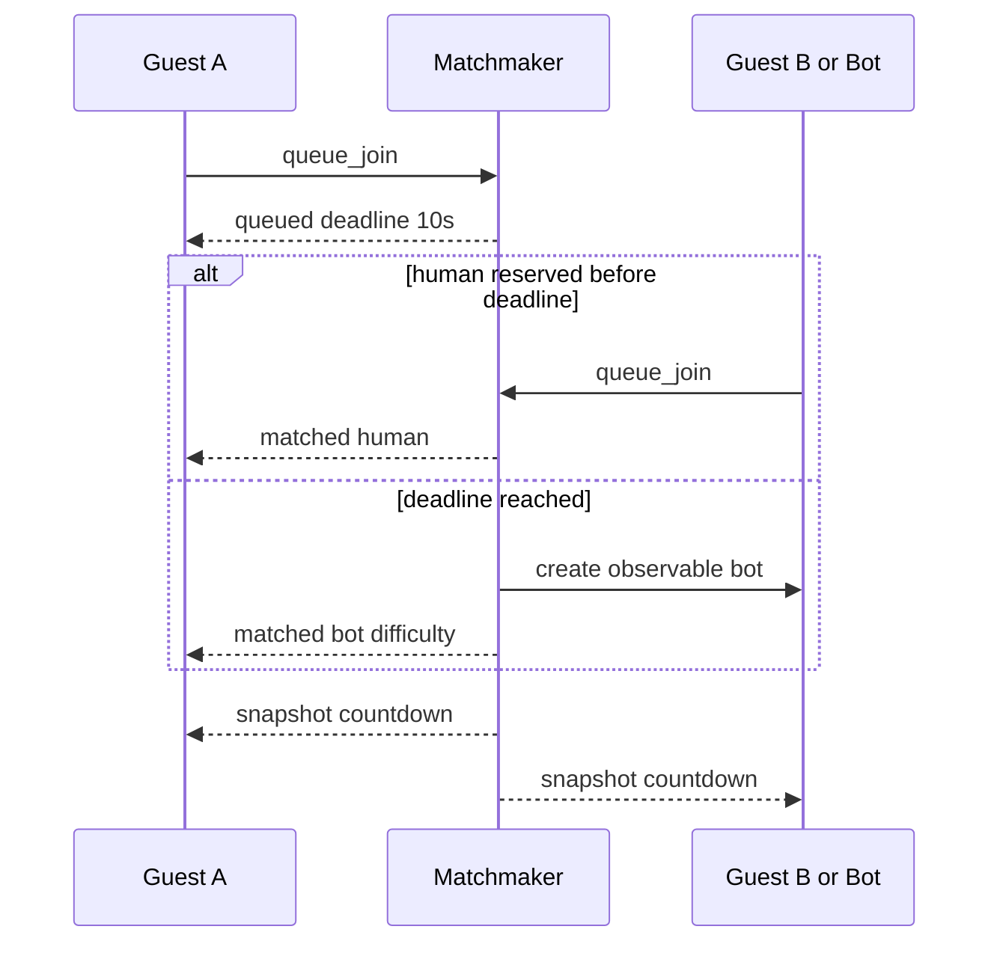
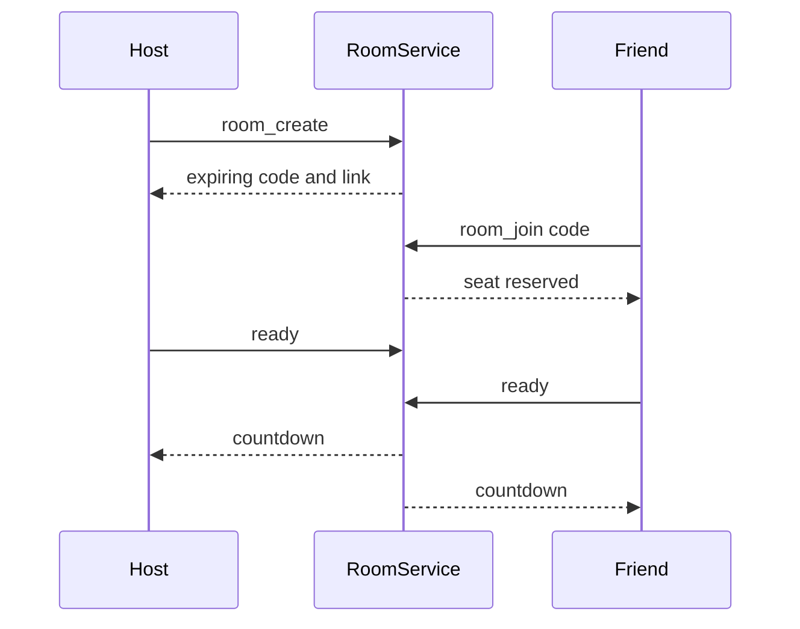
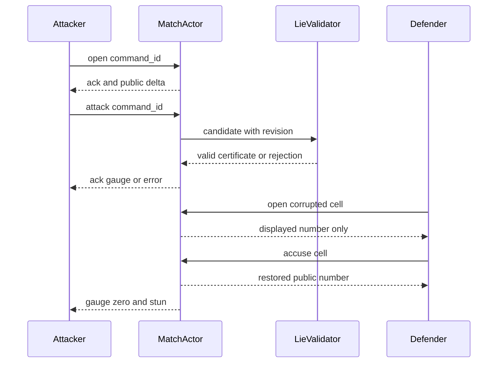
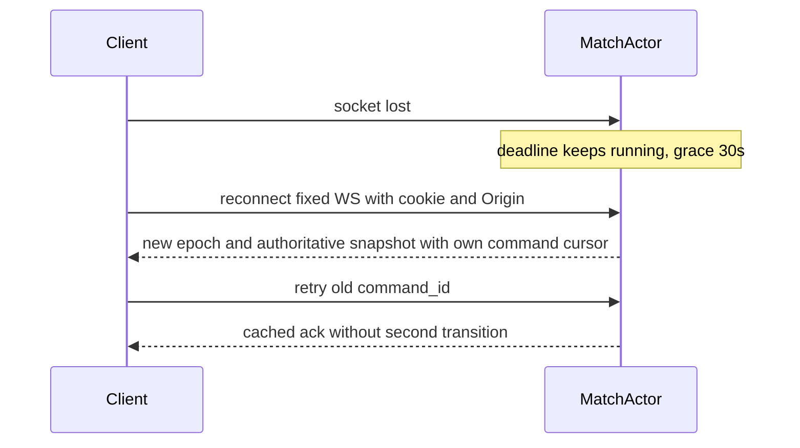
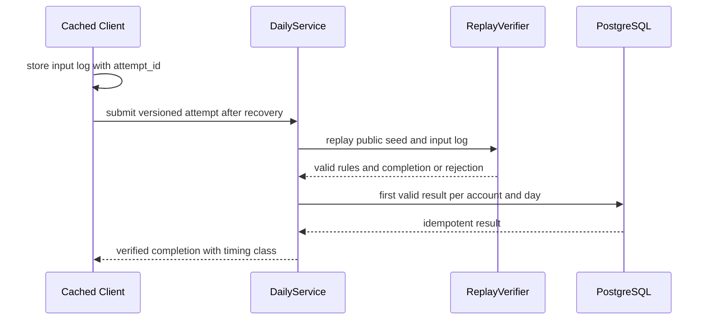

# 06. HTTP·WebSocket 프로토콜

> 대응: FR01/06/07/09/14, NFR02 · Rust public DTO → ts-rs → TS. 내부 Board와 public DTO는 분리한다.

#76은 [ADR0036](../adr/0036-opponent-reconnect-grace.md)의 opponent.reconnect_ms를 공개한다. null은 연결됨/종료, 양수는 Rust가 계산한 서버 유예 잔여,0은 권위 결과 대기다. 시간 감소만으로 매tick delta를 보내지 않으며 끊김·복귀·유예0은 공개 전환이다. 값은 해당 rules.reconnect_grace_ms 이하의u32다. 웹의 표시0은 forfeit/abandon 판정이 아니다.

## HTTP

| 경로 | 계약 |
|---|---|
| GET /api/v1/auth/providers | 필수4개 provider 가용 상태, secret/endpoint 없음; 실제 검수 #42 |
| GET /api/v1/auth/bootstrap | 최소 계정·메모리 CSRF·5분 browser cookie·provider 상태, no-store; 계정 생성 없음 |
| POST /api/v1/auth/{provider}/start | CSRF/Origin, login intent, one-use state·nonce·browser binding; authorize URL |
| GET /api/v1/auth/{provider}/callback | provider별 code/state 거래 검증·서버 token 교환; 세션 회전/닉네임 진입; no-store |
| GET /api/v1/me | 인증 필요, 내부 account ID와 게임용 nickname만, no-store |
| PATCH /api/v1/me | 닉네임만 검증, CSRF·Origin; 약관/선택 동의는 #21의 별도 정책 계약 |
| POST /api/v1/auth/logout | 서비스 세션 철회, 제공자 전체 로그아웃과 구분 |
| GET /api/v1/me/identities | 본인 제공자와 연결 시각만, no-store |
| POST /api/v1/me/identities/{provider}/link | 최근 재인증 필요, account에 바인딩한 link 거래 |
| POST /api/v1/auth/{provider}/reauth | 현재 계정에 이미 연결된 제공자로 명시적 재인증 |
| DELETE /api/v1/me/identities/{provider} | 최근 재인증·CSRF, 마지막 로그인 수단은 해제 불가 |
| POST /api/v1/me/export | 최근 재인증·CSRF, 본인 최소 데이터, token/subject 제외 |
| DELETE /api/v1/me | 최근 재인증·CSRF, 전 세션 철회·개인정보 삭제·제공자 token 철회 |
| POST /api/v1/auth/apple/notifications | Apple 서버 알림 서명/iss/aud 검증, 사용자 브라우저 API와 별도 |
| POST /api/v1/lobby | versioned status/queue_join/room_create/room_join/ready/cancel, 모든 호출 Origin·session-bound CSRF·nickname·bounded read/rate; 본인 상태만, no-store; [ADR0030](../adr/0030-authenticated-lobby-http-runtime.md) |
| GET /api/v1/bootstrap | 지원 locale·공개 rules·daily versions·server availability, 정답/시드 없음 |
| GET /api/v1/daily/{date} | UTC date·공개 seed/solver version·rules hash, 캐시 가능 |
| POST /api/v1/daily/{id}/attempts | attempt_id, input_log, elapsed 주장, version; replay 결과와 verification status |
| GET /api/v1/daily/{id}/leaderboard | 페이지 제한, verified/local 구분, 닉네임 안전 렌더 |
| GET /health/live, /health/ready | live 프로세스, ready DB·큐·capacity 상태, 내부 상세는 공개 금지 |

변경 HTTP는 same-origin·CSRF 토큰 검사, 크기/레이트 제한을 적용한다. WS는 쿠키 인증과 Origin 검증, account별 한 active session epoch로 탈취·다중 탭을 제어한다.

## WS envelope와 상태 노출

#70 웹 경계는 [ADR0033](../adr/0033-online-quick-match-ui.md)의 닫힌 공개 디코더·Rust 원천 출력 상한·고정 same-origin cookie WS·최초 snapshot 권한 확인·sequence/ACK를 적용한다. 입력8KiB와 출력128KiB를 구분한다. 입력 DTO에 계정/seat/seed/브라우저 시각을 추가하지 않는다.

```json
{"v":1,"match_id":"UUID","command_id":"UUID","client_seq":12,"session_epoch":2,"known_revision":44,"action":{"type":"open","cell":18}}
```

서버 게임 응답은 `{v,match_id,server_seq,server_time_ms,payload}`이며 payload의 type은 snapshot/delta/ack/error/match_end다. revision은 view 또는 ack 안에, command_id는 ack 안에 있다. 클라이언트 시간은 승패에 사용하지 않는다. 단일 입력 프레임 최대8KiB, 공개 출력 최대128KiB다. 숫자 cell은 0..255, UUID/enum/길이/version을 경계에서 검증한다.

#16의 actor/WS 구현은 [ADR0023](../adr/0023-authoritative-match-actor.md)을 따른다. 게임 action은 기존 PublicAction을 재사용하고 handshake/연결 epoch와 인증 철회 observer를 검증한다. 큐/방은 #64의 POST /api/v1/lobby 계약을 사용한다. 클라이언트 resume는 #18에서 같은 경계에 추가한다.

server_seq/revision은 본인의 공개 stream 기준이다. 상대 flag·상대에게 보이지 않는 gauge/공격 등록만 변경됐을 때 본인의 revision을 증가시키거나 빈 delta를 보내지 않는다. 내부 전역 ingress sequence·analysis revision을 public 카운터로 내보내 공격 시점/개수를 추측하게 만들지 않는다.

| 방향 | type | 주요 payload |
|---|---|---|
| HTTP C→S | status / queue_join / cancel | version, difficulty / source queue·room·preparing identity |
| HTTP C→S | room_create / room_join / ready | version, code, room_id, ready |
| C→S | open / flag / accuse / attack | cell 또는 빈 payload, attack에 target 금지 |
| WS handshake C→S | 재접속 | 고정 cookie/Origin WS; 서버 배정 매치·새 epoch·본인 last_client_seq를 snapshot으로 반환 |
| HTTP S→C | idle / queued / room / preparing / matched / failed | version/server_time_ms, 본인 queue deadline·좌석/ready·취소 identity·human/bot 종류 |
| S→C | snapshot / delta | 본인 opened 숫자·mine·flag·gauge·stun, 상대 진행률·공개 기절, 남은 시간 |
| S→C | ack / error | applied/duplicate/rejected, 안정된 error code |
| S→C | match_end | win/loss/draw/abort, reason, safe opened, 오류·지목 집계 |

상대 열린 칸·숫자, 숨은 seed·지뢰, active lie 표시·target·source·truth는 보내지 않는다. command_id별 최근 응답을 매치 기간+유예 동안 보관해 재전송을 같은 결과로 돌려준다. client_seq 재사용/역행과 epoch 불일치 거절; revision gap은 snapshot으로 복구한다. 구버전은 unsupported_version 응답 후 재로드 안내한다.

`known-neighborhood-v1`의 재접속 snapshot에는 본인의 공개 숫자 변경 이력을 포함한다. 최초 zero opening과 이후 변경 배치만 전달하고 상대 이력·solver의 safe/mine 결론·등록 후보·논리 truth·lie flag를 넣지 않는다. 이력은 서버가 만든 최대512개의 비어 있지 않은 배치이며 중복 셀·범위 밖 셀·닫힘 복귀·변경 없는 배치는 거절한다. 클라이언트가 제출한 이력으로 온라인 상태를 교체하지 않는다. [ADR0010](../adr/0010-public-certified-attack-strategy.md)

## 빠른 매칭과 친구 방





인간 상대 예약과 봇 생성은 한 번만 일어나는 원자적 상태 전이로 구현한다. 기한 이상 수신된 인간 상대는 다음 큐로 들어간다. 방 코드는 암호학적 난수8문자 제안, 10분 만료, 열거 레이트 제한, seat 소유는 세션에 묶는다. 링크의 코드는 초대 기능만 제공하고 기존 플레이어 신원을 대체하지 않는다.

## 대전·공격·재접속





heartbeat는 15초 ping, 45초 무응답 시 끊김 판정을 제안한다. 실제 끊김 감지는 최대 이 지연이 더해질 수 있으며 reconnect grace는 서버가 감지한 disconnect 시점부터다. reconnect backoff 0.5/1/2/4/8초+지터, 30초 유예는 서버 권위로 표시한다.

#18/#74는 [ADR0035](../adr/0035-reconnect-command-cursor.md)의 snapshot.last_client_seq(u32)를 Rust core의 본인 소비 순번에서 투영한다. 새 controller는 그다음 순번을 사용하고u32::MAX에서는 입력을 중단한다. 새 epoch로 같은 UUID/seq/action을 보내도 원본 ACK/revision만 반환한다. 상대 cursor나 내부 전역 sequence를 노출하지 않는다. 자동 backoff/재전송·30초 화면과 영속 장애 복구는 다음18 하위 작업이다.

## 데일리 제출과 한계



서버가 start ticket·heartbeat로 측정한 online attempt만 verified_time 순위에 들어간다. 오프라인 replay는 verified_completion으로 **완료/오류 순위**에 별도 표기하며 클라이언트 시간은 개인 참고값이다. 입력 replay는 규칙 일관성을 검증하지만 수동 풀이·실제 오프라인 경과시간을 증명하지 못한다. 첫 유효 완료 한 건만 공식 기록, 이후 재시도는 연습. 구버전 replay verifier는 최소7일 보존 제안, 만료 기록은 개인 로컬 기록으로 유지한다.

## OAuth 경계

#66 [ADR0031](../adr/0031-oauth-invitation-return.md)의 login start는 Rust AuthLoginRequest에서 생성한 `{locale,return_path,invite_code?}`를 받는다. 선택 코드는 canonical8문자/login/friends에만 허용하고 서버5분 거래에 보존한다. success→friends 또는 onboarding, 소비된 실패→login의 로컬 code 복귀를 제공한다. link/reauth에는 초대 필드를 허용하지 않는다. provider 요청·계정·세션·브라우저 저장소에 초대를 복사하지 않는다.

#45 계정 권리 계약은 [ADR0021](../adr/0021-account-rights-and-apple-revocation.md)을 따른다. `GET /api/v1/me/identities`는 제공자와 연결 시각만 공개한다. `POST /api/v1/me/identities/{provider}/link`와 `POST /api/v1/auth/{provider}/reauth`는 `{locale,return_path}`를 받고 현재 세션에 거래를 묶는다. 연결은 최근300초 인증이 필요하고 재인증은 이미 연결된 제공자만 허용한다. 민감 작업의 인증 기한 만료는409/reauth_required, 다른 계정의 subject나 마지막 제공자 해제는409/auth_conflict다.

`POST /api/v1/me/export`와 `DELETE /api/v1/me`, `DELETE /api/v1/me/identities/{provider}`는 strict `{}`와 같은 Origin·메모리 CSRF를 요구한다. 내보내기는 account UUID/nickname·생성/최근 접속 시각·provider/연결 시각만 포함한다. 해제·삭제는 모든 해당 계정 세션을 철회하고 cookie를 지운다. 응답 `AuthErasure.manual_apple_disconnect`는 Apple credential 부재/제공자 비활성으로 직접 철회가 필요한지를 알린다. 공개 DTO는 Rust에서 생성한다. 계정 권리 API의 본문 한도는4096byte다.

Apple의 `POST /api/v1/auth/apple/notifications`는 브라우저 Origin/CSRF 대신 검증한 서명·issuer·명시 audience·시간·jti를 사용한다. strict `{payload}`만32768byte 이내로 받으며 이메일 변경 알림은 저장하지 않는다. 원문 subject와 credential은 공개 응답·캐시에 포함하지 않는다.

#44의 구체적인 계약은 [ADR0020](../adr/0020-oauth-providers-and-http.md)을 따른다. start JSON은 `{locale,return_path}`, nickname JSON은 `{nickname}`, logout JSON은 `{}`이며 미정의 필드와4096byte 초과를 거절한다. bootstrap은 `{providers,account,session_revision,csrf}`다. account의 nickname은 onboarding 전 null, session_revision은 공개 UUID이고 cookie token/hash를 대신 노출하지 않는다. 키 없는 실행은4개 비활성/계정 null/CSRF null이고 무계정 연습을 유지한다. 미인증 me는401/auth_required, 잘못된 입력·바인딩은400/auth_invalid, 제공자/저장 장애는503/auth_unavailable다. callback 실패는 검증된 거래의 locale에만 auth_failed로 이동한다.

[17 인증](17-auth-privacy.md)을 따른다. Apple은 name/email scope 없는 code/query callback을 사용하고 form_post 추가는 별도 cookie 계약을 요구한다. callback은 일반 CSRF 헤더 대신 거래 검증을 수행한다. nickname 미설정 세션도 onboarding/me/logout과 연결·내보내기·삭제 권리를 행사할 수 있으며 대전·공식 기록에는 사용할 수 없다. 공식 attempt와 account 소유권을 검증하며 무계정 로컬 기록은 로그인 뒤 명시적 제출만 허용한다.

#13 public DailyMetadata/View/Step/Replay와 strict 입력·로그 경계는 [ADR0017](../adr/0017-deterministic-solo-daily-and-local-records.md)를 따른다. 공개 UTC seed와 online 비밀 seed를 구분하며 로컬 replay는 서버 검증 전 unverified다. [실제 native/WASM 재현](../verification/13-utc-daily-records-share.md).
