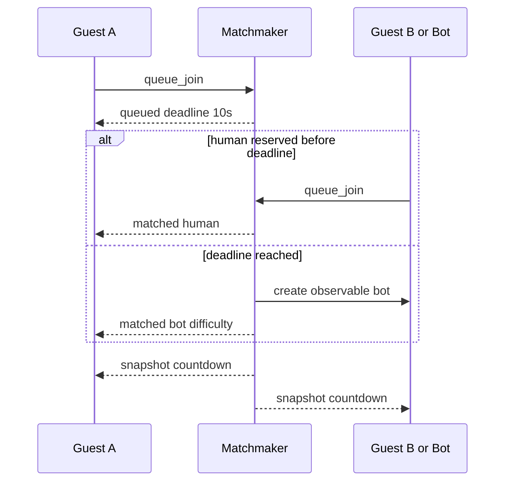
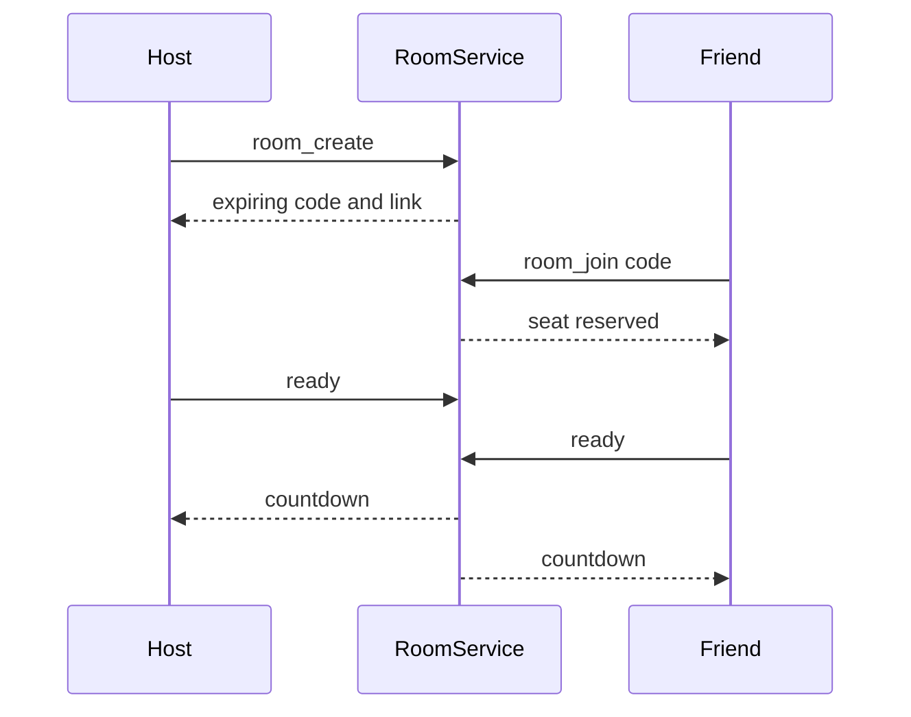
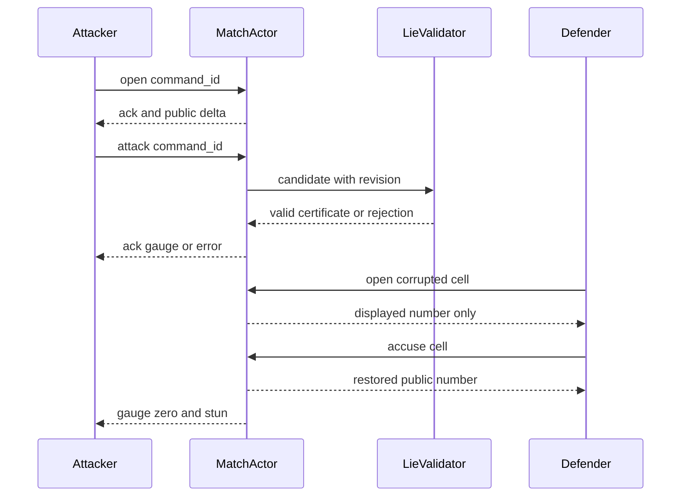
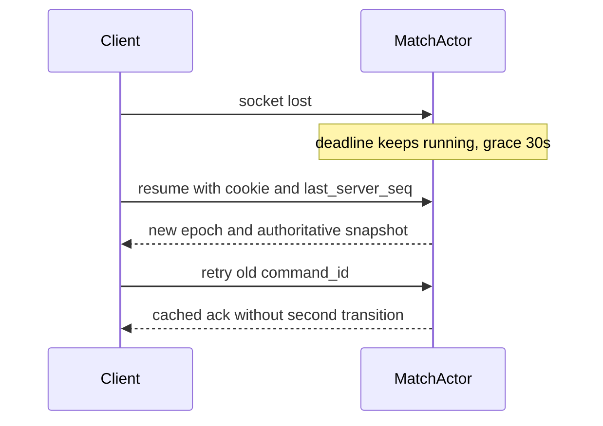

# 06. HTTP·WebSocket 프로토콜

> 대응: FR01/06/07/09/14, NFR02 · Rust public DTO → ts-rs → TS. 내부 Board와 public DTO는 분리한다.

## HTTP

| 경로 | 계약 |
|---|---|
| POST /api/v1/guests | nickname 검증, guest view; HttpOnly Secure SameSite=Lax 쿠키 발급 |
| PATCH /api/v1/guest | 닉네임 변경; CSRF·Origin 검사 |
| DELETE /api/v1/guest | 세션 철회·참여 이탈·관련 개인정보 삭제 요청 |
| GET /api/v1/bootstrap | 지원 locale·공개 rules·daily versions·server availability, 정답/시드 없음 |
| GET /api/v1/daily/{date} | UTC date·공개 seed/solver version·rules hash, 캐시 가능 |
| POST /api/v1/daily/{id}/attempts | attempt_id, input_log, elapsed 주장, version; replay 결과와 verification status |
| GET /api/v1/daily/{id}/leaderboard | 페이지 제한, verified/local 구분, 닉네임 안전 렌더 |
| GET /health/live, /health/ready | live 프로세스, ready DB·큐·capacity 상태, 내부 상세는 공개 금지 |

변경 HTTP는 same-origin·CSRF 토큰 검사, 크기/레이트 제한을 적용한다. WS는 쿠키 인증과 Origin 검증, guest별 한 active session epoch로 탈취·다중 탭을 제어한다.

## WS envelope와 상태 노출

```json
{"v":1,"type":"open","command_id":"UUID","match_id":"UUID","client_seq":12,"known_revision":44,"payload":{"cell":18}}
```

서버 응답: v, type, server_seq, revision, command_id(응답 연결), server_time_ms, payload. 클라이언트 시간은 승패에 사용하지 않는다. 단일 프레임 최대8KiB 제안. 숫자 cell은 0..255, UUID/enum/길이/version을 경계에서 검증한다.

| 방향 | type | 주요 payload |
|---|---|---|
| C→S | queue_join / queue_cancel | difficulty / queue_id |
| C→S | room_create / room_join / room_leave / ready | code, room_id |
| C→S | open / flag / accuse / attack | cell 또는 빈 payload, attack에 target 금지 |
| C→S | resume | match_id, last_server_seq, session_epoch |
| S→C | queued / room_state / matched | queue deadline, room seats, opponent_type |
| S→C | snapshot / delta | 본인 opened 숫자·mine·flag·gauge·stun, 상대 진행률·공개 기절, 남은 시간 |
| S→C | ack / error | applied/duplicate/rejected, 안정된 error code |
| S→C | match_end | win/loss/draw/abort, reason, safe opened, 오류·지목 집계 |

상대 열린 칸·숫자, 숨은 seed·지뢰, active lie 표시·target·source·truth는 보내지 않는다. command_id별 최근 응답을 매치 기간+유예 동안 보관해 재전송을 같은 결과로 돌려준다. client_seq 재사용/역행과 epoch 불일치 거절; revision gap은 snapshot으로 복구한다. 구버전은 unsupported_version 응답 후 재로드 안내한다.

## 빠른 매칭과 친구 방





인간 상대 예약과 봇 생성은 한 번만 일어나는 원자적 상태 전이로 구현한다. 기한 이상 수신된 인간 상대는 다음 큐로 들어간다. 방 코드는 암호학적 난수8문자 제안, 10분 만료, 열거 레이트 제한, seat 소유는 세션에 묶는다. 링크의 코드는 초대 기능만 제공하고 기존 플레이어 신원을 대체하지 않는다.

## 대전·공격·재접속





heartbeat는 15초 ping, 45초 무응답 시 끊김 판정을 제안한다. 실제 끊김 감지는 최대 이 지연이 더해질 수 있으며 reconnect grace는 서버가 감지한 disconnect 시점부터다. reconnect backoff 0.5/1/2/4/8초+지터, 30초 유예는 서버 권위로 표시한다.

## 데일리 제출과 한계


서버가 start ticket·heartbeat로 측정한 online attempt만 verified_time 순위에 들어간다. 오프라인 replay는 verified_completion으로 **완료/오류 순위**에 별도 표기하며 클라이언트 시간은 개인 참고값이다. 입력 replay는 규칙 일관성을 검증하지만 수동 풀이·실제 오프라인 경과시간을 증명하지 못한다. 첫 유효 완료 한 건만 공식 기록, 이후 재시도는 연습. 구버전 replay verifier는 최소7일 보존 제안, 만료 기록은 개인 로컬 기록으로 유지한다.
