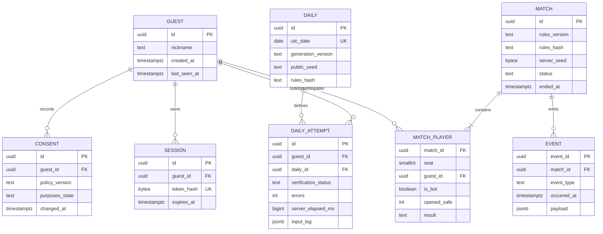

# 07. PostgreSQL 모델

> 대응: FR01/09/14/16 · DB 구현·migration은 M3에서 작성한다.

## 제약과 인덱스

- MATCH_PLAYER PK=(match_id, seat), seat 0/1, guest null은 bot 또는 삭제된 신원에 한정; bot flag·guest 유효성 check.
- SESSION token_hash unique, guest_id와 expires_at 인덱스; 원문 토큰 저장 금지.
- DAILY utc_date+generation_version unique를 실제 제약으로 사용한다. ERD의 날짜 UK는 해당 버전 내 유일함을 뜻한다.
- DAILY_ATTEMPT attempt_id PK, first_valid(guest_id,daily_id) partial unique. 동시 제출은 transaction과 unique 제약으로 한 건만 확정.
- 순위 인덱스(daily_id, verification_status, errors, server_elapsed_ms, completed_at, id); null offline time은 online 순위 제외.
- MATCH(status, ended_at), EVENT(occurred_at,event_type), CONSENT(guest_id,changed_at) 인덱스. 게스트 삭제 시 결과의 guest_id는 null로 분리하고 event 식별자를 제거한다.

닉네임은 1~20 grapheme, NFC·허용 문자 검증, HTML로 렌더하지 않는다. JSON payload schema version을 기록하고 저장 전 타입 검증한다. 매 클릭은 메모리 actor가 관리하며 최종 결과·필수 운영 이벤트만 비동기 batch로 DB에 쓴다. 결과 저장 실패 시 bounded retry queue와 기록 pending 상태, 장애 종료를 일반 승패로 조작하지 않는다.

## 저장과 보존 제안

| 데이터 | 기간 / 삭제 |
|---|---|
| 게스트·세션 | 180일 미접속 게스트 삭제, 세션 최대30일; 사용자 요청 즉시 철회 |
| 매치 결과 | 90일 후 식별자 제거·집계, seed/replay는7일 제한 |
| 데일리 input log | 검증 후7일, 공개 순위90일, 집계13개월 |
| 원시 분석 이벤트 | 30일, 익명 일별 집계13개월 |
| 동의 기록 | 정책/목적 최소값180일 제안, 법적 검토 뒤 확정 |
| 백업 | 일7개·주4개, 암호화와 제한 접근; 삭제 후 최대28일 잔존 고지 |

## Migration과 복구

sqlx 바인딩만 사용, 앱 계정은 필요한 DML만, migration 계정은 분리한다. sqlx offline metadata를 CI에 포함한다. expand→신·구 버전 동시 지원→배포→후속 contract 순서, 파괴적 rollback 대신 이전 앱 호환성 확인 또는 forward fix다.

매일 `pg_dump` custom format, checksum, 동일 머신 밖의 사용자 매체로 암호화 복사. 백업이 같은 disk에만 있으면 장애 복구 백업으로 인정하지 않는다. 복구는 빈 DB에 pg_restore→migration version·row count·참조 무결성→대표 순위/API 확인, RPO/RTO 기록. 이 단계에서는 DB 컨테이너나 비밀번호를 생성하지 않는다.
