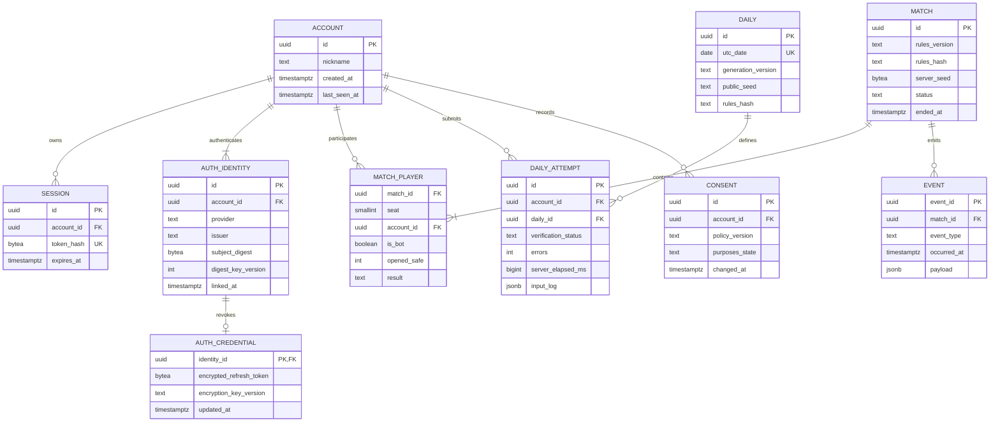

# 07. PostgreSQL 모델

#16의 [ADR0023](../adr/0023-authoritative-match-actor.md)은 `online_match_results`의 match UUID unique·rules hash·서버 전용8byte seed·종료 elapsed/reason/저장 시각과 `online_match_players`의 seat0/1·account FK cascade(봇은 null)·최종 outcome/집계를 별도 transaction에 저장한다. 닉네임/세션/identity는 복사하지 않는다. 계정 삭제는 참여 행을 제거하고 식별자 없는 매치 부모만 남긴다. 저장 전에 account key-share lock으로 존재를 확인하며 이미 삭제된 인간의 참여 행은 생성하지 않는다. 중복 부모는 참여 행을 재삽입하지 않으므로 삭제된 개인정보를 retry로 복원하지 않는다. 이전 migration checksum은 바꾸지 않는다.

#44는 별도 migration `202610080002_auth_locale.sql`로 기존 인증 거래에 8locale allowlist를 추가한다. 기존 migration checksum을 바꾸지 않고 en을 기본값으로 보존한다. public session_revision은 기존 auth_sessions.id를 조회하며 새 secret/개인정보 컬럼이 아니다. [ADR0020](../adr/0020-oauth-providers-and-http.md).

> 대응: FR01/09/14/16 · DB 구현·migration은 M3에서 작성한다.

## 제약과 인덱스

- MATCH_PLAYER PK=(match_id, seat), seat 0/1, account null은 bot 또는 삭제된 신원에 한정; bot flag·account 유효성 check.
- AUTH_IDENTITY unique(provider,issuer,subject_digest,digest_key_version); 모든 기존 key version 조회와 재해시를 transaction으로 처리한다. 현재 digest 기준 advisory lock과 회전 중 쓰기 중지로 서로 다른 key version의 중복 연결도 막는다. 원문 subject·이메일·password 컬럼 없음.
- AUTH_CREDENTIAL은 Apple 철회용만, AEAD+AAD와 외부 key vault, identity 삭제 시 목적 제한 revoke queue 후 제거. 일반 provider token 장기 저장 없음.
- SESSION token_hash unique, account_id와 expires_at 인덱스; 원문 토큰 저장 금지.
- DAILY utc_date+generation_version unique를 실제 제약으로 사용한다. ERD의 날짜 UK는 해당 버전 내 유일함을 뜻한다.
- DAILY_ATTEMPT attempt_id PK, first_valid(account_id,daily_id) partial unique. 동시 제출은 transaction과 unique 제약으로 한 건만 확정.
- 순위 인덱스(daily_id, verification_status, errors, server_elapsed_ms, completed_at, id); null offline time은 online 순위 제외.
- MATCH(status, ended_at), EVENT(occurred_at,event_type), CONSENT(account_id,changed_at) 인덱스. 계정 삭제 시 결과의 account_id는 null로 분리하고 event 식별자를 제거한다.

닉네임은 2~16 grapheme, NFC·Unicode 문자/숫자/내부 공백 검증·제어문자 거절, HTML로 렌더하지 않는다. JSON payload schema version을 기록하고 저장 전 타입 검증한다. 매 클릭은 메모리 actor가 관리하며 최종 결과·필수 운영 이벤트만 비동기 batch로 DB에 쓴다. 결과 저장 실패 시 bounded retry queue와 기록 pending 상태, 장애 종료를 일반 승패로 조작하지 않는다.

## 저장과 보존 제안

| 데이터 | 기간 / 삭제 |
|---|---|
| 계정·identity | 계정 삭제/연결 해제까지; 사용자가 요청하면 세션 즉시 철회·식별자 제거. 휴면만으로 자동 삭제하는 정책은 채택하지 않음 |
| 세션·auth transaction | 세션 최대30일, auth 거래5분; 원문 token/state DB 보관 없음 |
| Apple credential | 연결 기간만 암호화; 삭제시 철회, 실패 재시도 목적 queue 최대24시간 |
| 매치 결과 | 90일 후 식별자 제거·집계, seed/replay는7일 제한 |
| 데일리 input log | 검증 후7일, 공개 순위90일, 집계13개월 |
| 원시 분석 이벤트 | 30일, 익명 일별 집계13개월 |
| 동의 기록 | 정책/목적 최소값180일 제안, 법적 검토 뒤 확정 |
| 백업 | 일7개·주4개, 암호화와 제한 접근; 삭제 후 최대28일 잔존 고지 |

## Migration과 복구

#66의 [ADR0031](../adr/0031-oauth-invitation-return.md)은 새 nullable auth_transactions.invite_code를 추가한다. 정확8byte/허용 문자·login/friends CHECK와 기존 NULL 거래 호환성을 적용하고 원자 consume에 함께 복원한다. 초대는5분 transaction 목적에만 보존하며 계정/세션/결과에 복사하지 않는다.

#45 migration003은 기존001/002를 수정하지 않고 account당 provider unique, 계정 거래의 session hash binding, Apple credential의 일일 확인 시각/revision,28일 삭제 tombstone, 최대24시간 암호화 revoke queue와 알림 jti digest receipt를 추가한다. [ADR0021](../adr/0021-account-rights-and-apple-revocation.md)을 따른다. 현재 계정·identity·credential·session·거래의 삭제는 한 transaction이며, 백업 복구에서 tombstone 적용은 #25 운영 검증 대상이다. 후속 개인 기록 테이블은 account 소유 FK와 동일 삭제 port에 참여하고, 공개 매치 집계의 익명화 계약은 해당 구현 이슈에서 검증한다.

계정 행을 먼저 잠근 뒤 세션/identity를 검증해 동시 해제의 마지막 로그인 수단을 보존한다. revoke queue는 계정 FK 없이 철회 목적의 ciphertext와 identity AAD만 보관한다. `FOR UPDATE SKIP LOCKED`·60초 lease·lease UUID로 중복 처리/오래된 완료를 막고24시간 이후 claim하지 않는다. 만료 ciphertext의 물리 제거는60초 cleanup 및 복구 운영 절차에 의존한다. 일일 확인 결과는 ciphertext와 check revision이 같을 때만 적용하고, 늦은 알림은 credential/연결 갱신 시각보다 이전이면 새 연결을 철회하지 않는다.

sqlx 바인딩만 사용, 앱 계정은 필요한 DML만, migration 계정은 분리한다. 동적 query/bind는 실제 DB 통합으로 검증하고 query macro를 도입할 때만 offline metadata를 CI에 포함한다. [ADR0019](../adr/0019-auth-foundation-and-delivery.md)의 최소 스키마에는 nickname 미설정 onboarding, 5분 거래와 암호화 PKCE verifier가 포함된다. expand→신·구 버전 동시 지원→배포→후속 contract 순서, 파괴적 rollback 대신 이전 앱 호환성 확인 또는 forward fix다.

매일 `pg_dump` custom format, checksum, 동일 머신 밖의 사용자 매체로 암호화 복사. 백업이 같은 disk에만 있으면 장애 복구 백업으로 인정하지 않는다. 복구는 빈 DB에 pg_restore→migration version·row count·참조 무결성→대표 순위/API 확인, RPO/RTO 기록. 이 단계에서는 DB 컨테이너나 비밀번호를 생성하지 않는다.

필수 개인정보 목적·최소 scope·삭제 tombstone·계정 연결은 [17 인증/개인정보](17-auth-privacy.md)에 정의한다. 무계정 로컬 연습은 DB에 계정을 만들지 않는다. 약관 수락 버전과 광고/분석 동의는 별도 목적 필드로 기록한다. 보존 기간은 제품 정책 제안이며 법정 의무 기간이라고 표현하지 않는다.

#13 무계정 IndexedDB 개인 기록은 공식 PostgreSQL daily_attempt와 분리한다. v1·unverified·공개 metadata·attempt UUID·개인 elapsed/stat·strict native replay만 최대30개 보관하며 첫 local clear는 원자적이다. 저장 실패는 메모리 fallback이다. [ADR0017](../adr/0017-deterministic-solo-daily-and-local-records.md), [검증](../verification/13-utc-daily-records-share.md).
