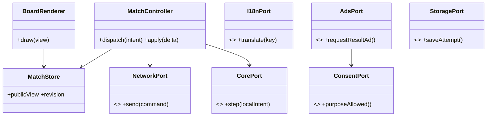
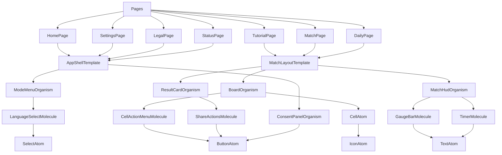

# 08. 클라이언트 구조와 Atomic Design

> 대응: FR08~13, NFR01/03/06 · Preact+Vite, PixiJS, i18next, Rust WASM.

MatchController는 intent와 공개 결과 연결만, MatchStore는 공개 상태만, BoardRenderer는 표시만 책임진다. WsNetworkAdapter, WasmCoreAdapter, I18nextAdapter, GoogleAdsAdapter, IndexedDbAdapter, CertifiedCmpAdapter는 각 포트를 구현한다. composition root에서 online/local 모드를 선택하고 store에 비밀 Board를 넣지 않는다.

## 컴포넌트 목록과 재사용

추가 Atoms: Input, Label, Badge, FocusRing, VisuallyHidden. 추가 Molecules: NicknameField, RoomCodeField, ConnectionBadge, StunIndicator, FormError, AdSlotPlaceholder. 추가 Organisms: Lobby, DailyLeaderboard, TutorialGuide, SettingsPanel, LegalContent, MaintenancePanel. Template는 AppShell/MatchLayout/FormLayout; Page는 Home/Lobby/Tutorial/Match/Result/Daily/Settings/Legal/Status다. 각 파일은 표시 또는 한 상호작용 책임으로 분리한다.

Pixi도 CellDisplay→BoardDisplay, FlagDisplay, StunEffect, GaugeDisplay로 나누고 재사용한다. CellAtom은 DOM 접근성 표현이고 CellDisplay는 Canvas 표시로 역할이 다르다. 숫자/상태의 판정 로직을 복제하지 않고 같은 PublicCellView를 사용한다.

#11의 pool/dirty 렌더·DOM fallback·조작 경계는 [ADR0015](../adr/0015-public-board-rendering-and-input.md)를 따른다. 게임 명령 처리와 실제 로컬 대전 연결은 #12 controller가 맡는다.

#12 FIFO/Clock/core port·세션 lifecycle과 학습용 실제 규칙 판은 [ADR0016](../adr/0016-local-match-controller-and-training-fixture.md)를 따른다. 첫 방문/skip/재학습과 초대 보존을 분리하고 실제 이해도 E1/E2는 #27에서 참여자와 검증한다.

## 토큰과 상태

design-tokens 원천에 semantic color(background/surface/text/danger/flag/lieFeedback), spacing(4/8/12/16/24), typography(scale·locale fonts), radius, elevation, duration, motion policy를 둔다. CSS custom property와 Pixi 숫자값을 생성한다. 색만으로 mine/flag/stun을 구분하지 않는다. 예산과 토큰값은 실제 저사양 기기 테스트로 조정한다.

서버 delta는 revision 순으로 적용, 누락은 snapshot 요청. UI optimistic 변화는 focus/hover·네트워크 대기 표시까지만 허용하며 안전칸/공격 성공/승패를 로컬 확정하지 않는다. store selector로 셀 변경만 redraw, WASM 계산은 Web Worker에서 수행하고 TypedArray 전송을 활용한다.

## 오프라인 경계

#14 공개 precache·다중 탭 idle/시작 lock·IndexedDB pending/명시적 제출·설정 삭제 경계는 [ADR0018](../adr/0018-public-offline-cache-and-safe-update.md)를 따른다. 결과에서 홈으로 이동해 모든 탭이 안전할 때 업데이트하며 #15/#19 전에는 공식 API 전달 성공을 만들지 않는다.

#13의 UTC 솔로 데일리·개인 미검증 기록·공유 allowlist와 IndexedDB 경계는 [ADR0017](../adr/0017-deterministic-solo-daily-and-local-records.md)를 따른다. #14 캐시/제출 대기와 #19 공식 검증을 구분한다.

service worker는 versioned shell/locale/core 정적 asset만 캐시하고 공개 데일리는 캐시한 Rust/RNG/rules로 유도한다. API 응답/쓰기·세션·광고는 캐시하지 않는다. IndexedDB는 개인 기록·대기 replay, 필수 localStorage는 locale·튜토리얼·cache-disabled 설정을 저장한다. 저장 용량·private mode 실패 시 메모리 fallback과 기록 유실을 안내한다. 결과 화면도 activity lease를 유지하고 모든 탭이 홈으로 이동한 뒤 사용자 버튼으로 업데이트한다. 최초 미캐시 offline 접속은 브라우저 네트워크 실패이며 별도 정적 점검 안내도 네트워크 도달이 필요하다.
