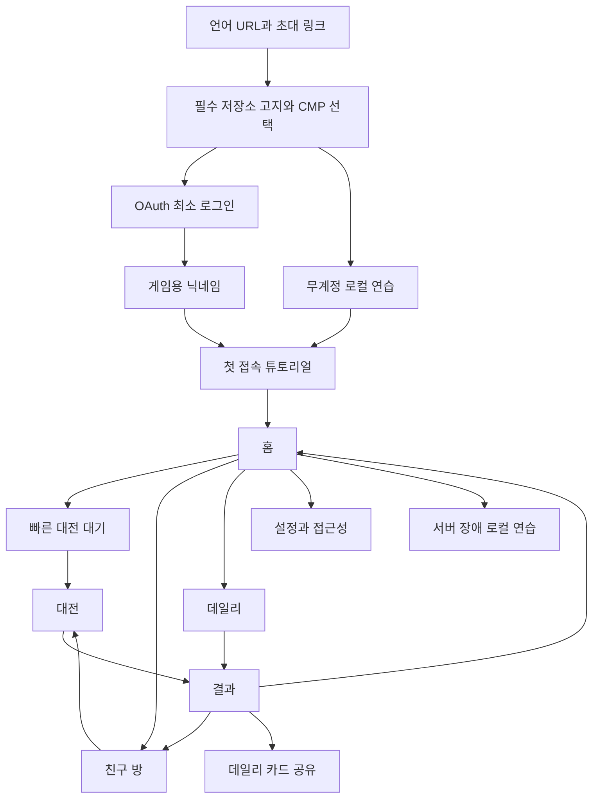

# 09. 화면·조작·접근성

> 대응: FR06~13, NFR06 · [여정](../product/04-journey.md)



CMP는 광고 선택 흐름이며 미동의도 OAuth/로컬 연습/튜토리얼로 진행한다. 초대 링크의 만료/입장 상태는 튜토리얼 뒤 확인하며 방 코드 외 신원정보를 URL에 넣지 않는다.

```text
홈 (좁은 화면)
┌──────────────────────────┐
│ Liar Sweeper  [언어] [설정]│
│ [닉네임]                 │
│ [빠른 대전] [친구 대전]   │
│ [오늘의 퍼즐] [규칙 배우기]│
│ 서버 상태 / 로컬 연습     │
│ 메뉴 배너 고정 영역       │
│ 정책 · 약관 · 동의 설정   │
└──────────────────────────┘

대전
┌──────────────────────────┐
│ 상대: 봇/친구  진행률  시간│
│ 내 진행률  게이지 [공격]  │
│ 보드: 확대·이동 가능한 격자│
│ 숫자·깃발·기절 상태       │
│ [열기] [깃발] [지목] 모드 │
│ 연결 상태 / 도움          │
└──────────────────────────┘

결과
승패/무승부/장애취소 · 이유 · 진행률
지목/반사/실수 · [재대결] [홈]
데일리: UTC 날짜 · 검증 상태 · [공유]
광고는 허용 조건일 때만 결과 뒤 표시
```

## 입력

PC: 클릭 open, 우클릭 flag, 열린 숫자의 메뉴에서 accuse, A로 지목 모드, Space/Enter 실행, 화살표 셀 이동. 모바일: tap 현재 모드, 450ms long press로 메뉴, 이동/pinch를 클릭과 구분하고 long press 후 tap 중복 발생 방지. 공격은 별도 버튼이고 상대 셀 선택 UI는 없다. 설정에서 동작 도움을 즉시 볼 수 있다.

## 반응형·접근성

<768px는 단일 보드, ≥768px도 상대 보드는 진실 노출 방지를 위해 진행 요약만. 16×16 전체를 360px에 억지로 넣으면 터치 영역이 부족하므로 기본 확대+pan, 44px 이상 액션 버튼, keyboard zoom과 현재 좌표 안내를 제공한다. 가로/세로 회전은 상태를 유지한다.

접근 가능한 DOM grid에 cell label(좌표·공개 숫자·flag·상태), roving tabindex와 aria-live 결과/기절/연결을 둔다. 공개 숫자만 읽으며 숨은 true value·lie 여부를 aria-label에 넣지 않는다. 키보드만으로 대전·지목·설정·동의 가능. reduced-motion, 충분한 대비, 색+아이콘, 광고와 조작의 간격, 초점 복구를 E2E와 수동 검수한다.

오류 상태는 만료 방·full·unsupported version·reconnect·offline cache missing·daily rejected·ads unavailable을 안정된 번역키로 제공한다. 서버 장애는 승패로 표시하지 않고 “대전 취소”라고 표시한다.

## 제공된 디자인 적용

[18 화면별 기준](18-design-layout.md)에 design_layout 원본 18개와 상태·반응형·토큰·차이를 연결했다. 로그인 기본 영역에 Google·Apple·카카오·네이버를 제공한다. 이미지의 Discord 기본 버튼은 확장 영역 후보로 이동한다. 로그인 없이 즉시 가능한 기능은 로컬 연습이며 온라인 대전은 OAuth가 필요하다. 닉네임은 제공자 실명 대신 직접 정한다.
