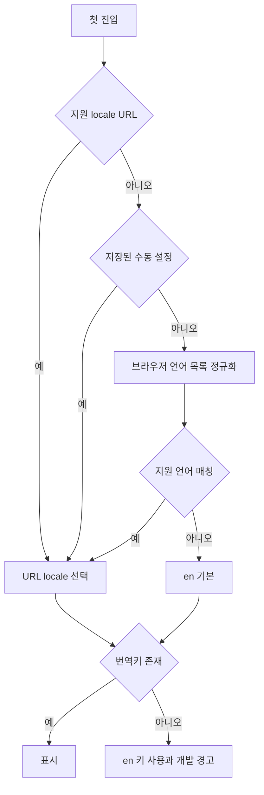
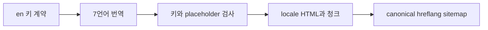

# 10. 다국어·URL·SEO

> 대응: FR11/13 · 8언어 en, ko, ja, zh-CN, es, pt-BR, de, fr.

URL이 있으면 URL이 우선이고 사용자가 언어를 바꾸면 URL+저장값을 함께 갱신한다. 접두어 없는 `/` 진입만 자동 감지한다. ko-KR→ko, ja-JP→ja, es-*→es, pt→pt-BR 제안. zh-Hans/zh-CN→zh-CN; zh-TW/Hant는 번체 지원으로 오인하지 않도록 en fallback 후 선택 UI를 제공한다. 언어 변경으로 match_id·방 코드·보드 상태를 잃지 않는다.

## 리소스·번역

`apps/web/src/locales/{locale}/{common,game,tutorial,errors,legal}.json`을 사용한다. #10에서 common46개 키를8언어로 작성했다. 나머지 namespace는 해당 화면 구현에서 추가한다. en은 키 계약 원천이고 누락·초과·placeholder·복수형은 CI에서 검사한다. 화면 문구는 번역키, 코드 식별자와 주석은 영어. 시간·숫자는 Intl, 절대 시간은 UTC 날짜 고지, 닉네임은 Unicode NFC/grapheme 검증이다.

번역: en 원문 확정→8언어 초안→핵심 규칙/광고 동의/정책의 사용자 또는 언어 검수자 검토→키 계약 검사→스크린샷 overflow/긴 텍스트 확인. 기계 번역을 법적 검수 완료로 간주하지 않는다. 시스템 폰트와 필요한 glyph만 쓰고 CJK 전체 폰트 다운로드는 피한다.

## URL와 검색

각 공개 정적 페이지에 `/en/`, `/ko/` 등 localized URL, self canonical, 8개 hreflang와 x-default를 일관되게 생성한다. 홈·튜토리얼 소개·규칙·정책은 빌드 시 HTML을 제공하고 sitemap에 포함한다. 방·대전·개인 결과는 noindex 및 공유 시 코드/민감정보 처리. 번역 변경 때 메타·OG·약관 버전도 갱신한다.

오프라인 캐시는 현재 언어+en을 우선 저장한다. 미캐시 언어로 변경하면 en 표시와 복구 후 다운로드 안내를 제공한다.
