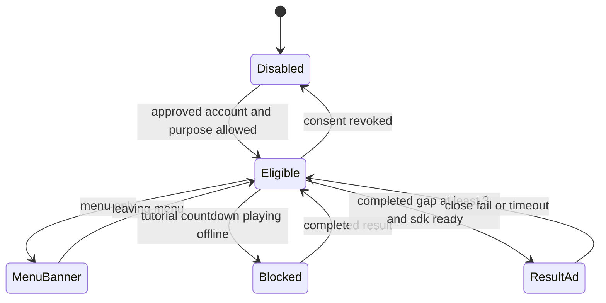
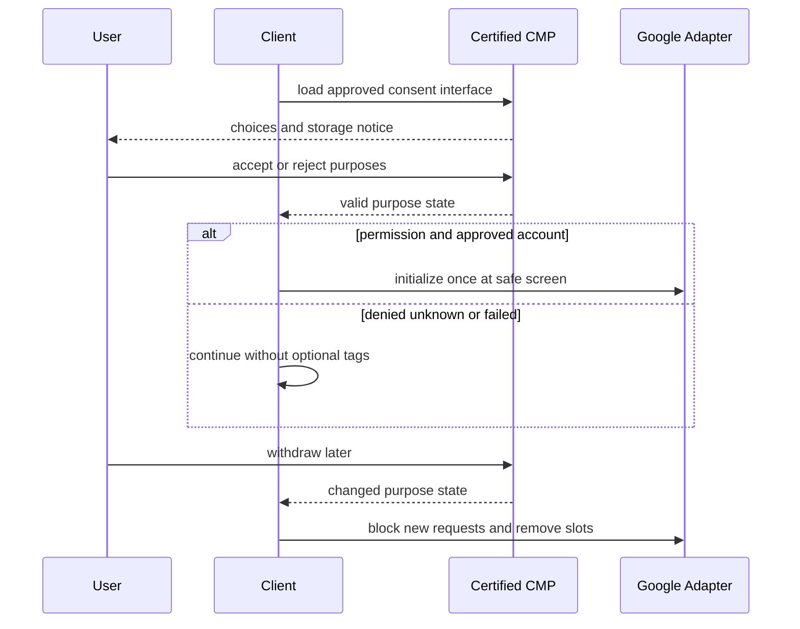

# 11. 광고·동의·정책 설계

> 대응: FR12/13 · 실제 광고 account ID·CMP·도메인 설정은 사용자 담당.

Google은 해당 지역의 맞춤형 광고 제공 시 Google 인증 CMP와 IAB TCF 통합을 요구한다. [Google 공식 요구사항](https://support.google.com/adsense/answer/13554116?hl=en)
본 제품은 EEA·영국·스위스뿐 아니라 지역 불명일 때도 비필수 광고/분석을 기본 차단하고 유효 선택 후 허용하는 보수적 구현을 제안한다. 인증이 모든 법적 의무 충족을 뜻하지는 않으며 공개 전에 실제 정책을 검토한다.

## 빈도와 게임 상태

튜토리얼 제외 정상 대전·데일리 완료만 카운트, abort·이탈 제외. 첫 요청은 최소3번째 완료 이후, 이후 **요청한 완료 번호 간격≥3**으로 제한한다. SDK no-fill/실패도 요청 slot을 소비해 즉시 재시도하지 않는다. 광고 노출 수는 실제 callback로 집계한다. 로컬 봇도 온라인 연결·동의가 있을 때만 완료 카운트에 포함하며 오프라인 광고는 금지한다.

카운터는 account 서버 값과 브라우저 저장값 중 보수적인 제한을 사용하고 다중 탭 lock을 적용한다. 로그아웃/스토리지 초기화 우회는 완전히 막을 수 없으므로 판당 전면≤1도 추가한다. 메뉴 배너를 떠난 뒤 countdown/playing 전에 광고 요소를 제거하고 자동 광고의 in-game 삽입을 끈다. 동시에 한 광고만 요청한다. 재대결은 광고 대기 timeout(3초 제안) 후 즉시 진행하며 노출 중에는 매칭/카운트다운을 시작하지 않는다.

API는 실제 노출 가능 여부와 빈도를 자체 판단한다. 자체 3판 cap과 별개이며 첫 요청에 SDK 빈도 제한이 적용되지 않을 수도 있다. [Ad Placement API](https://developers.google.com/ad-placement), [빈도 제어](https://developers.google.com/ad-placement/docs/ad-rate)

CMP 자체 로딩 등 필수 동의 처리와 광고 SDK를 분리한다. 분석 동의와 광고 동의를 별도 purpose로 판단하며 동의 실패·광고 차단은 게임 실행을 막지 않는다. 동의 철회 후 신규 요청 차단, 재열기 버튼은 모든 화면의 설정에서 접근 가능하게 한다.

## CSP와 문서

기본 default-src self, object-src none, base-uri self, frame-ancestors none, connect-src self+wss same origin. 광고용 script/frame/img/connect 도메인은 **선택한 CMP와 Google의 실제 통합 공식 요구사항·관측 결과**를 근거로 별도 allowlist 파일에서 관리한다. `*`나 전역 unsafe-inline으로 해결하지 않고 nonce/hash 호환성을 검증한다. report-only로 대표 흐름 확인 후 enforce한다.

8언어 개인정보·약관은 운영자/연락처, 처리 목적·법적 근거·보존·삭제, 쿠키/IndexedDB, Google/Cloudflare 이전, 동의/철회, OAuth 계정 연결/내보내기/삭제, 미성년자 방침을 포함한다. 운영자 정보는 없는 값을 꾸며내지 않는다. `ads.txt`는 사용자 실제 publisher ID를 받은 뒤 작성하고 예시 ID를 배포하지 않는다. 광고 미승인 상태의 공개 베타는 무광고로 운영 가능하다.
