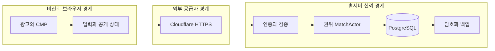

# 12. STRIDE 위협 모델

> 대응: FR01/07/09/12~14/16, NFR02/07 · 자산: 숨은 판·세션·게스트 개인정보·결과·가용성·백업.

| STRIDE | 구체 위협 | 대응 | 검증 |
|---|---|---|---|
| Spoofing | 쿠키 탈취·room code로 seat 탈취 | 암호학적 토큰·hash 저장·HttpOnly/Secure·세션 소유 seat·epoch | TS20 세션/Origin |
| Tampering | client 승패·지뢰·게이지·시간 조작 | intent만 수신·타입/범위 검사·서버 tick·revision/dedup | TS21 잘못된 메시지 |
| Repudiation | 중복 명령·결과 부인 | command_id·server_seq·최종 결과 transaction·최소 감사 기록 | TS15 replay 중복 |
| Information disclosure | seed·상대 셀·실제 lie 값 노출, 로그 토큰 | public DTO 분리·응답 회귀 검사·로그 redact·내부 DB | TS02/TS22 비밀 |
| Denial of service | 메시지 폭주·생성 지수 탐색·코드 열거 | guest/IP rate·frame cap·연결/queue 상한·bounded worker·용량 초과 입장 거절 | TS21/TS27 부하 |
| Elevation of privilege | migration 권한 악용·광고 script XSS·컨테이너 root | DML 계정·별도 migration·CSP·escape·non-root·최소 mount | TS20/TS28 복구 |

## 인증·입력 한도 제안

HTTPS 동일 origin. WS handshake Origin exact match, 쿠키/epoch 검사; CORS는 다른 origin을 허용하지 않는다. 상태 변경 HTTP는 CSRF token+Origin 검사. 세션 토큰은 CSPRNG≥256bit, 쿠키 최대30일, 삭제 즉시 철회. guest별1 active connection 제안, 재접속 시 이전 epoch 무효화.

WS8KiB/frame, 평균20cmd/s·burst40; guest 생성·room join·daily replay는 각각 별도 작은 quota. IP 한도는 NAT 공유 사용자 고려, trusted proxy만 IP 해석, 원시 IP 지속 저장 없이 단기 rate key. 닉네임은 HTML escape·Unicode 길이 제한; sqlx query parameters only. injection 문자열을 SQL이나 로그 포맷으로 조립하지 않는다.

## 치트 한계

online 비밀 seed와 정답을 숨기고 상대 진행률만 공개한다. 동일 보드는 자기 풀이 정보를 상대가 알 수 있는 위험이 남아 사용자의 고정 규칙을 보존하며 이를 명시한다. 자동 솔버·화면 OCR·친구 간 답 공유를 완전히 방지할 수 없다. 입력 속도·지목 패턴은 조사 신호이고 단독 영구 제재 근거가 아니다. 로컬/공개 데일리는 순위 신뢰 수준을 표시한다.

공개 정답 전송 여부는 WebSocket JSON, HTML, WASM online 입력, network cache, DOM aria-label, 로그에서 검사한다. 온라인 DTO와 로컬 Board 직렬화를 분리한다. 단순 화면에서 숨기는 것으로 보안을 충족하지 않는다.

## 공급망과 운영

lockfile·보안 감사(cargo audit/pnpm audit)·최소 CI permissions, PR에서 비밀값 접근 금지. secret은 gitignore+host 권한으로 관리, 유출시 commit 삭제만 하지 않고 토큰을 회전한다. 백업·DB 접근은 운영자만; Tunnel 토큰·DB 사용자 분리. 종속성 취약점 예외는 근거·기간·이슈를 명시하고 조용히 감사 실패를 무시하지 않는다.

정책·지역 동의는 [11](11-ads-consent.md), 개인정보 보존은 [07](07-database.md)에 둔다. 위협 모델은 광고 공급자 추가·프로토콜 변경 때 갱신한다.
