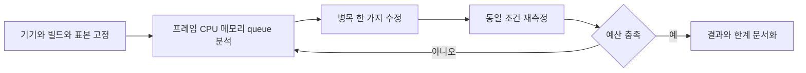

# 13. 성능 예산과 용량 측정

> 대응: NFR03/04/07 · 수치는 목표이며 실제 측정은 M1/M2/M5 산출물이다.

| 영역 | 예산 / 측정 |
|---|---|
| 초기 JS | gzip≤200KiB; 홈 critical path, 게임·WASM·광고 지연 로드 |
| 게임 JS 추가 | gzip≤500KiB 제안, Pixi와 UI 포함; build chunk report 별도 |
| WASM | gzip≤1MiB 초기 제안; worker 로드·초기화 시간 별도 |
| LCP | p75≤2.5초, 저사양 모바일·제한된4G·warm/cold 구분 |
| 보드 렌더 | 60fps 목표, frame p95≤16.7ms·p99≤33ms, 30fps 선택 옵션 |
| 클라이언트 메모리 | 대전 중 heap≤100MiB 제안; GPU texture 별도 |
| 서버 입력 | enqueue→state commit p95≤20ms, network RTT 제외 |
| 생성 | release native 16×16/40 10k seeds p95≤100ms, worst·채택률 보고 |
| 공격 검증 | 비동기 bounded budget, 실제 p95·timeout·성공비율 보고; 입력 경로와 분리 |

## 클라이언트

Pixi/WebAssembly/광고/추가 locale를 필요 시 로드한다. 매 프레임 전체 보드 생성·React tree 갱신 금지, dirty cell·sprite pool·TypedArray 사용. device pixel ratio 상한과 모션 축소를 선택할 수 있게 한다. 초기 예산 제외 자산도 전체 bytes/time으로 보고해서 숨기지 않는다. HANDOFF의 JS 예산을 initial path로 해석한 것은 승인 대상이다.

## 미니 PC 용량

CPU·RAM·disk·OS·유선 업로드·전력·빌드 commit을 기록한다. k6로 HTTP guest/WS 연결/10초 queue/4분 두 명 실제 입력/공격 검증을 포함한다. 동시10→25→50→100매치, 각10분+마지막30분 soak를 제안하되 장비 상태에 따라 중단한다. CLI 단일 서버 연결 수를 실제 인간 동접으로 표현하지 않는다.

임계값은 처리 p95≤20ms, 오류<1%, CPU 지속<70%, 메모리<75%, bounded queue overflow 0이다. 최초 임계 초과 이전 단계의 **70%**를 초기 admission limit으로 잡는다. `동접 한도 = 측정된 안정 매치 수×2 + 제한된 lobby 여유`이며 숫자를 측정 전 확정하지 않는다. egress/매치와 백업 disk 증가도 보고한다.

## 글로벌 지연

서버 내부20ms가 전 세계 RTT20ms를 뜻하지 않는다. 한국·일본·유럽·미주 참여자 RTT p50/p95를 수동 수집하고 경기 중 연결 지연을 표시한다. client timestamp로 승자를 정해 치트를 허용하지 않는다. latency compensation·지역 서버는 이번 범위 밖, 공정성 인식이 실패하면 매칭/규칙을 사용자와 재검토한다.
