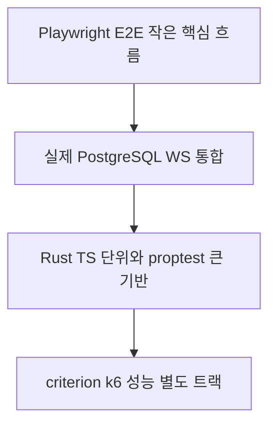

# 14. TDD와 검증 전략

> 대응: NFR05/08 · 입력: [실행 가능한 시나리오](../product/19-test-scenarios.md)

## 테스트 경계

#82는 [ADR0039](../adr/0039-authenticated-personal-result-read.md)의 요청·투영 Red, HTTP Origin/CSRF·3단계 단일 기한·역순 세션·공유 취소·별도 WS/로비 권위·실제PG 양 좌석/봇/삭제·90일 경계를 검증한다. `scripts/check_auth_coverage.py`에 results/model.rs의95% line gate를 추가하고 누락된 도메인을 성공으로 세지 않는다.

새 결과 단위 테스트 본문은 `crates/server/tests/unit/result_*.rs`에 두고 cfg(test)의 path module로 실행한다. 기존 coverage의 tests/examples 제외 패턴이 테스트 자체를 분모에서 제외하며 제품 도메인만 측정한다.

#84 NFR05/08·TS18/26/30: #85/PR86의 develop a7c3099 병합·종료 뒤 단위 테스트 준비와 DOM 조회를 분리 측정한다. 실제 동적 route의 cold import는 Chromium E2E에서 유지한다. 단위 테스트에서는 페이지 모듈 준비 시간을 hook에 명시할 수 있지만 실제 App→GameRoute→권한→256셀 DOM 경로를 mock하지 않는다. 긴 시나리오는 독립 행동으로 나누고 기존 단언을 보존한다. accessible role/name·노출 여부 검증을 CSS 개수나 hidden 조회로 대체하지 않는다. 테스트/제품 timeout·retry·worker 설정을 늘려 통과하지 않는다. 측정과 뒷받침되는 수정·미확인 원인은 [검증 기록](../verification/84-unit-arrangement-observation.md)에 구분한다.

같은 작업의 전체180개 실행은4fail/176pass40.61초였고 jsdom32회 생성338.90초가 추적 시간의62%였다. fake port로만 검증하는 순수 서비스 테스트는 파일별 Node 환경을 명시하고 실제 DOM/브라우저 어댑터 테스트에만 jsdom과 modal/cleanup setup을 적용한다. 격리/동시성은 그대로 유지한다. 정상500ms status poll은 사용자 명령 수와 구분하고, locale 유지 검사는 정확한 초기 status·room_join·ready 명령과 그 identity가 반복되지 않음을 확인한다.

#83/#85 FR10/NFR05/07·TS18/20/26: production 두 탭 업데이트의 재시도 성공에도 첫 실패 trace/진단을 업로드한다. 시험 observer는 재로드 전후 클릭·전송/응답·token 준비/해제·controllerchange·native worker 상태를 수집하고 제한 시간/추가 retry로 통과를 만들지 않는다. #74/#80 간헐 load 실패의 원인은 미확정이다. #85는 진단 보존만 먼저 병합하고 #83을 열어 둔다. [ADR0018](../adr/0018-public-offline-cache-and-safe-update.md)의 실제 반복·강제 실패·원인 분리 기준을 따른다.

- 코어: cargo test + proptest. fake Clock/RNG, 작은 판 전수 검사, Board invariant, safe 추론 증명, 두 lie 조합, timeout·동시 순서, native/WASM fixture 일치.
- 클라이언트: Vitest·DOM testing. fake Network/Storage/Ads/I18n/CMP, 공개 delta·revision·입력 모드·long press·토큰 접근 금지.
- 통합: 실제 PostgreSQL/testcontainers 또는 격리 compose test DB, sqlx migration·transaction·unique·삭제·idempotency; 실제 axum WS handshake·Origin·disconnect.
- E2E: 정상 한 판, 봇10초 백필, 친구2 browser contexts, 튜토리얼, UTC 데일리/순위, 8언어, 오프라인/재접속, 동의 거부/철회, 광고 실패·cap, 키보드.
- 성능: criterion 생성/solver, k6 매치·DB·용량. 실제 미니 PC 환경과 결과를 기록한다.

## Red → Green → Refactor

이슈의 시나리오를 선택→실패 테스트 실행/원인 기록→최소 구현→통과→SRP·중복 제거→관련 회귀/문서 갱신. 테스트 자체가 실행 안 된 에러를 의도한 행동 실패로 기록하지 않는다. 구현과 같은 계산을 복제한 assertion보다 공개 결과/불변식/반례를 검증한다.

코어·도메인 line coverage≥95%, 전체≥80% 목표. cargo llvm-cov와 Vitest coverage로 계층별 분모를 명시하고 generated DTO·vendor 제외 근거를 적는다. 단순 수치 통과가 공정성 증명을 대신하지 않는다. UI 시각·번역·접근성은 수동 검수를 보완한다.

```mermaid
flowchart LR
  PR[develop 대상 PR] --> Docs[문서와 Mermaid 검사]
  Docs --> Gate[브랜치 이슈와 승인 게이트]
  Gate --> Lint[fmt clippy Oxlint typecheck]
  Lint --> Unit[단위 속성와 생성 타입 검사]
  Unit --> DB[실DB WS 통합]
  DB --> Web[build와 Playwright]
  Web --> Audit[보안 감사와 예산]
  Audit --> Review[위임된 에이전트 코드 리뷰]
  Review --> Merge[병합과 이슈 종료]
```

M0의 docs/contribution-gate에 이어 #4에서 Rust·웹·실제 PostgreSQL·WASM·공유 타입·Playwright CI를 병합했다. #5는 테스트/벤치 파일을 분모에서 제외한 core source line coverage≥95%를 CI로 검증한다. 전체 애플리케이션80%는 아직 측정되지 않은 후속 목표다. PR은 해당 변경에 필요한 검사만 실행하며 단계별 required checks를 확장한다. k6·복구는 사용자 장비에서 별도 수동 증거를 PR에 첨부한다.

CI는 contents read 기본, untrusted PR에 secret 금지, 최신 안정 의존성 추가와 lockfile 재현 설치과 무료 실행량을 확인한다. Mermaid는 GitHub 지원 chart 문법만 사용해 실제 parse 검사한다.

#89 → [ADR0040](../adr/0040-personal-result-web.md): 최소 DTO/인증 전후 proof/취소·역순·WS 우선·권한/후보·8언어와 실제 PostgreSQL/HTTPS PC/mobile의 최종 알림 유실·actor 정리 후 조회를 TDD로 검증한다.

#91 → [ADR0041](../adr/0041-auth-recovery-response-observation.md): 철회 뒤 실제 HTTPS bootstrap 응답을 브라우저 전달 전에 관측하고 동일 응답을 전달한다. 앱의 null proof 이후 signal 취소와 늦은 CDP body 조회의 수명 차이를 분리하며 기존 offline 쓰기0·권한 제거·후속 독립 proof를 유지한다.

#93은 [ADR0042](../adr/0042-unknown-result-details.md)와 TS16을 따라 decoder/실제 DB의 unknown 양성 Red→Green, 이전 known행의 forward upgrade 보존·16개 null패턴·부분/타 reason/outcome·본인200/타인404·writer 충돌/삭제 비복원을 검사한다. PG/HTTPS PC/mobile에서는 actor 정리 후 SQL fixture의 unknown 결과를 운영 reader/router로 조회하고8언어·숫자 미생성·일반 storage0를 검증한다. 이 fixture는 실제 프로세스 재시작의 증거가 아니며 journal/startup/processkill은 후속18이다.

#95 FR11/14/16·NFR05/08·TS15/16/20/21/26/31/35/36 → [ADR0043](../adr/0043-result-response-observation.md) → one-use 실제 결과 HTTP 응답 관측/동일 전달·known/unknown PC/mobile 반복·[검증95](../verification/95-result-response-observation.md). 제품/기한/SW/timeout/retry 변경 없음.

#97 FR14/16·NFR01/02/05/07/08·TS15/16/20/21/31/35/36 → [ADR0044](../adr/0044-online-storage-owner.md) → 같은 raw 연결의 session lock/write·bounded 큐/2초 deadline·owner loss ready/프로세스 종료·실제 PG/HTTP 검증 → [검증97](../verification/97-online-storage-owner.md). 기존 인스턴스를 종료한 뒤 단일 새 인스턴스로 교체하며 journal/startup abort/OS kill-restart 결과 복구는 다음 작업이다.

#99 FR14/16·NFR01/02/05/07/08·TS15/16/20/21/31/35/36 → [ADR0045](../adr/0045-result-retention-anchor.md) → 실제 저장 시각/90일 보존 anchor 분리·forward/NULL fallback·DST/정확 경계·known JSON/삭제 비복원 → [검증99](../verification/99-result-retention-anchor.md). 새 journal의 늦은 복구가 보존을 연장하지 않게 하며 실제 물리 정리25와 재시작 복구는 후속이다.

#101 FR14/16·NFR01/02/05/07/08·TS15/16/20/21/31/35/36 → [ADR0046](../adr/0046-active-match-journal.md) → typed active journal/register/discard/strict final·same-owner startup unknown abort·최소 schema/FK삭제·admitted anchor/seed 상한·실제 PG/관련 gates → [검증101](../verification/101-active-match-journal.md). 공개 admission/main 전환·OS kill-restart 통합은 후속이며 storage foundation을 사용자 복구 완료로 보고하지 않는다.
