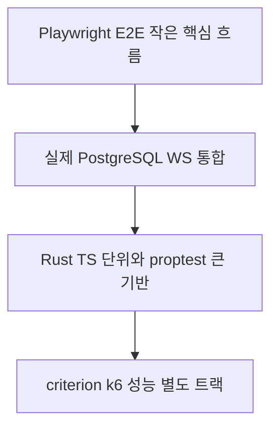

# 14. TDD와 검증 전략

> 대응: NFR05/08 · 입력: [실행 가능한 시나리오](../product/19-test-scenarios.md)

## 테스트 경계

- 코어: cargo test + proptest. fake Clock/RNG, 작은 판 전수 검사, Board invariant, safe 추론 증명, 두 lie 조합, timeout·동시 순서, native/WASM fixture 일치.
- 클라이언트: Vitest·DOM testing. fake Network/Storage/Ads/I18n/CMP, 공개 delta·revision·입력 모드·long press·토큰 접근 금지.
- 통합: 실제 PostgreSQL/testcontainers 또는 격리 compose test DB, sqlx migration·transaction·unique·삭제·idempotency; 실제 axum WS handshake·Origin·disconnect.
- E2E: 정상 한 판, 봇10초 백필, 친구2 browser contexts, 튜토리얼, UTC 데일리/순위, 8언어, 오프라인/재접속, 동의 거부/철회, 광고 실패·cap, 키보드.
- 성능: criterion 생성/solver, k6 매치·DB·용량. 실제 미니 PC 환경과 결과를 기록한다.

## Red → Green → Refactor

이슈의 시나리오를 선택→실패 테스트 실행/원인 기록→최소 구현→통과→SRP·중복 제거→관련 회귀/문서 갱신. 테스트 자체가 실행 안 된 에러를 의도한 행동 실패로 기록하지 않는다. 구현과 같은 계산을 복제한 assertion보다 공개 결과/불변식/반례를 검증한다.

코어·도메인 line coverage≥95%, 전체≥80% 목표. cargo llvm-cov와 Vitest coverage로 계층별 분모를 명시하고 generated DTO·vendor 제외 근거를 적는다. 단순 수치 통과가 공정성 증명을 대신하지 않는다. UI 시각·번역·접근성은 수동 검수를 보완한다.

```mermaid
flowchart LR
  PR[develop 대상 PR] --> Docs[문서와 Mermaid 검사]
  Docs --> Gate[브랜치 이슈와 승인 게이트]
  Gate --> Lint[fmt clippy ESLint typecheck]
  Lint --> Unit[단위 속성와 생성 타입 검사]
  Unit --> DB[실DB WS 통합]
  DB --> Web[build와 Playwright]
  Web --> Audit[보안 감사와 예산]
  Audit --> Review[사용자 리뷰]
  Review --> Merge[병합과 이슈 종료]
```

M0에는 docs와 contribution-gate만 실제 구현한다. 제품 테스트·coverage·DB·빌드 CI는 승인 뒤 M1 첫 이슈에서 추가하고, 현재 통과했다고 주장하지 않는다. PR은 해당 변경에 필요한 검사만 실행하되 전체 구현 단계별 required checks를 확장한다. k6·복구는 사용자 장비에서 별도 수동 증거를 PR에 첨부한다.

CI는 contents read 기본, untrusted PR에 secret 금지, 최신 안정 의존성 추가와 lockfile 재현 설치과 무료 실행량을 확인한다. Mermaid는 GitHub 지원 chart 문법만 사용해 실제 parse 검사한다.
