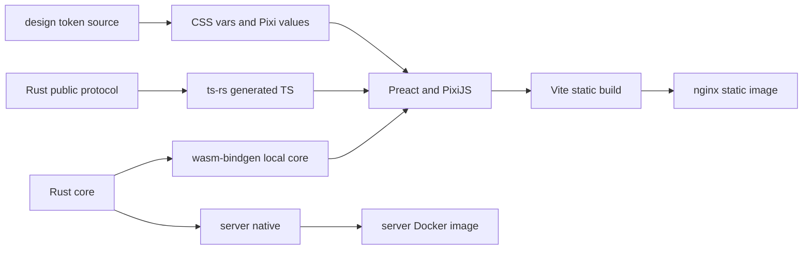

# 15. 모노레포·빌드 경계

> 대응: NFR01/05/08 · **아래 제품 디렉토리는 승인 뒤 생성한다.** 기존 Next/Nest 코드는 재사용하지 않는다.

```text
search-mine/
  AGENTS.md, CLAUDE.md, README.md, CONTRIBUTING.md
  docs/{planning,product,design,adr,workflow}/
  .agents/skills/{liar-design-review,liar-tdd,liar-issue-pr}/
  .claude/{rules,skills}/
  .github/{ISSUE_TEMPLATE,workflows}/
  scripts/{validate_docs.py,check_mermaid.mjs}
  # M1 이후 계획
  Cargo.toml, Cargo.lock
  crates/
    core/           # domain, solver, generator, rules, bot
    protocol/       # public DTO, version, TS generation
    server/         # application + ports + infra + HTTP/WS
    wasm/           # local core boundary
  apps/web/         # Preact atomic UI, Pixi, services, locales
  packages/
    protocol/       # generated TS; 직접 수정 금지
    design-tokens/  # token source and generated CSS/Pixi values
  config/game-rules.toml
  deploy/           # compose/nginx/tunnel/backup/runbook
  tests/{fixtures,e2e,load}/
```

Rust workspace와 pnpm workspace를 사용하되 버전은 구현 첫 이슈에서 공식 호환성 확인 후 pin한다. workspace root lockfiles를 커밋한다. 제품 파일은 설계 승인 전 생성하지 않는다. 문서 검사 스크립트·GitHub 템플릿·CI는 초기 작업 체계이므로 이번 PR에 포함한다.



TS protocol generator는 schema 변경 PR에서 실행하고 generated diff를 검사한다. 내부 Board/seed 타입은 생성 대상에 넣지 않는다. 버전 불일치·누락은 build fail, Rust native/WASM golden fixtures를 공통으로 읽는다. 규칙은 core 하나이며 i18n·광고·렌더링은 web adapter에 둔다.

문서 원문은 docs/planning에 보존한다. 최신 사용자 지시→AGENTS/워크플로→승인 PRD/설계/ADR→원문 순으로 판단하며 오래된 HANDOFF의 커밋/브랜치 규칙은 최신 workflow가 대체한다.
