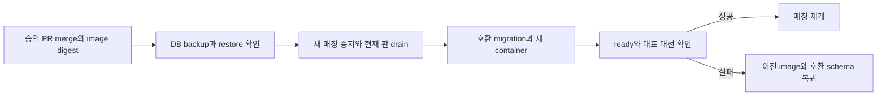

# 16. 관측·배포·복구 운영

> 대응: FR16, NFR07 · 공개 실행은 M5·사용자 계정/장비 작업 이후다.

## 로그와 헬스

구조화 JSON: timestamp, level, request_id, component, match_id, action_type, outcome_code, duration_ms. 토큰·쿠키·집IP·nickname·secret seed·정답은 redact. stdout rotation7일 제안. 진단에 필요한 account ID는 접근 제한 로그에서만 가명화하고 제품 이벤트와 분리한다.

live는 process alive, ready는 DB·schema version·입장 capacity·worker health. 공개에는 boolean/안정 code만, 내부에는 bounded queue length·active matches·solver timeout·input p95·WS disconnect·DB write 실패·disk 여유·backup age를 제공한다. Uptime Kuma는 선택이며 무료 한도나 외부 모니터링 계정을 전제로 하지 않는다.

## 업데이트·롤백

1. 리뷰된 develop commit의 image digest·static manifest·rules version을 기록한다.
2. 백업·disk·schema 호환성 확인. 새 매칭 차단, 최대4분+유예 drain.
3. expand migration 후 서버와 정적 자산 배포, health·account·bot/human test·daily 검증.
4. 실패하면 이전 image/static manifest로 돌아가고 contract migration을 배포와 동시에 하지 않는다.
5. 결과·측정·복구 시간은 운영 이슈에 기록한다. 무중단 다중 서버 운영은 주장하지 않는다.

## 장애

정전·회선: 캐시된 local mode 안내, 온라인 판은 복구 시 abort. DB 장애: 새 공식 대전·순위 쓰기 차단, bounded pending 결과 재시도, 데이터 손실 여부 확인. disk full: admission 중지·백업 공간 정리 정책·임의 삭제 금지. Tunnel 장애: 사용자 계정/토큰/connector 로그 확인, origin 포트 공개로 우회하지 않는다.

복구 훈련: 별도 빈 DB에 최신 백업→checksum→pg_restore→schema/row·대표 순위→서비스 ready→측정된 RPO/RTO 기록. 목표 RPO24h/RTO2h, 실제 성적이 부족하면 공개 전에 개선한다. 계정 삭제가 백업에 최대28일 남는 사실은 정책에 고지한다.

## 운영자 확인 항목

미니 PC 사양·OS, 전력 실측, 디스크/별도 백업 매체, 자동재시작, 유선 회선/통신사 가정용 서비스 제공 약관, 도메인/Cloudflare 계정, AdSense/H5 승인, Google 인증 CMP, 운영자 연락처, 번역 검수·미성년자 방침을 확인한다. 비밀값을 이슈나 채팅에 붙여넣지 않는다.

현재는 운영 runbook 설계이며 Docker Compose·nginx·DB·Tunnel을 실행하거나 유료 서비스를 생성하지 않는다.
