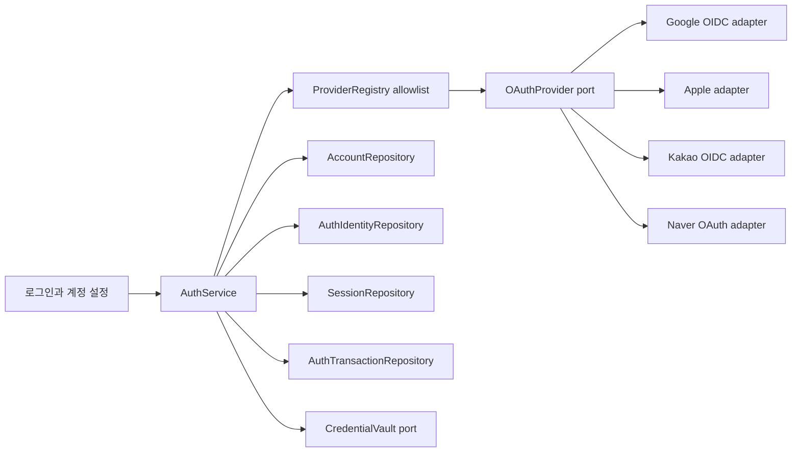
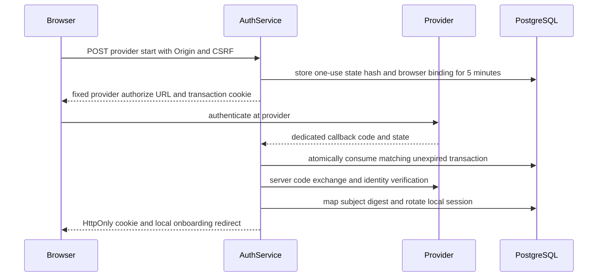

# 17. OAuth 인증·개인정보 최소 수집

구현 상세: [ADR0021 계정 권리·Apple 철회](../adr/0021-account-rights-and-apple-revocation.md)는 #45의 최근 재인증, 세션에 고정된 연결, 원자 credential 저장/계정 삭제와 목적 제한 queue를 구체화한다. 실제 제공자 검수는 #42에 남긴다.

> 대응: FR01/13/16, NFR01/02 · TS01/20/29/31~36 · [ADR 0009](../adr/0009-oauth-minimal-identity.md)
> 2026-10-06 사용자 변경 요청: 비밀번호 미보관, 최소 정보, Google·Apple·카카오·네이버 필수, 다른 제공자도 재사용 가능한 구조.

## 계정과 로컬 연습

온라인 대전·친구 방·공식 데일리 제출은 OAuth 계정으로 인증한다. 로그인 없이 봇·튜토리얼·캐시된 데일리 연습은 가능하며 이 경로는 서버 계정을 만들지 않는다. 비밀번호 입력·회원가입·복구 API, password/hash 컬럼을 만들지 않는다. OAuth 제공자의 비밀번호는 해당 제공자 화면에서만 입력한다.

첫 인증 후 게임용 닉네임을 정한다. 제공자 이름·이메일을 닉네임으로 가져오지 않고 임의 추천을 제시한다. NFC 정규화 후 2~16 grapheme, Unicode 문자·숫자·내부 공백을 허용하고 제어문자·양방향 제어문자·HTML은 거절한다. 경계와 confusable/금칙어 방침을 테스트하며 닉네임은 본인 인증 수단이 아니다. 닉네임 공개와 실명 사용을 피하라는 안내를 제공한다.

## 필수 제공자와 권한

| 제공자 ID | 검증한 신원 | 최소 요청 | 제공자별 처리 |
|---|---|---|---|
| google | 검증된 OIDC `iss`, `sub` | `openid`만 | Authorization Code + PKCE S256 + state + nonce; `email`, `profile`, offline access 요청 없음 |
| apple | 검증된 ID token `iss`, `sub` | `scope` 생략 | `response_type=code`, `response_mode=query`, state + nonce; 이름·이메일 요청 없음. Services ID·HTTPS 등록 도메인·서버 서명 키 필요 |
| kakao | 검증된 OIDC `iss`, `sub` | `openid`만 | 앱 OIDC 활성화, 이메일/프로필/전화 등 추가 동의 항목 해제, confidential 서버 code flow + state + nonce |
| naver | 토큰으로 서버가 조회한 프로필의 `id` | 개발자 콘솔 기본 이용자 식별자만 | 서버 code flow + state, client secret; 프로필 응답에서 `id`만 매핑. 이름·메일·전화·생년월일·성별·사진 선택 안 함 |

첫 공개 버전에는 위 4개를 모두 실제 연결하고 검수한다. 설정 키 미발급을 로그인 성공으로 가장하지 않는다. Discord/Microsoft/LINE 등은 후속 확장 후보이며 공개 전에 각 공급자의 최신 공식 계약을 확인한다. 국가/지역에서 특정 공급자 접속이 안 될 때 다른 제공자와 로컬 연습을 안내한다.

PKCE 지원 여부는 어댑터 capability에 명시한다. Google 및 공식 discovery에서 확인한 Kakao에는 S256을 강제한다. Apple·네이버에는 확인되지 않은 PKCE 매개변수를 보내지 않는다. 서버 client 인증, provider별 고정 callback, state 브라우저 바인딩과 OIDC nonce를 적용하고 TS32/33으로 검증한다. Google openid-only 실제 상호운용은 #42 검수 대상이며 추가 개인정보 scope를 임의 요청하지 않는다. [ADR0019](../adr/0019-auth-foundation-and-delivery.md)는 저장 경계와 순차 구현을 구체화한다. 신규 제공자는 최소 권한과 동등한 보호를 확인한 후 활성화한다.

## 포트와 어댑터

`OAuthProvider`는 authorize request 구성, code 교환, 검증된 subject 반환, revoke를 담당한다. `VerifiedIdentity`는 provider/issuer/subject와 필요한 철회용 credential만 가진 내부 타입이다. raw 응답·이메일·사진을 공통 DTO에 실어 보내지 않는다. `AuthService`는 계정 생성/연결, 트랜잭션 소비, 세션 회전만 책임진다. issuer·endpoint·redirect URI·scope는 서버 allowlist이며 브라우저가 임의 endpoint를 설정할 수 없다.

## 인증 순서와 보안

state/nonce/transaction binding을 CSPRNG 256bit 이상으로 생성한다. state는 hash로 저장하고 provider·브라우저·intent(login/link/reauth)·기존 account·허용 return path와 묶는다. 만료 5분, 오류/취소 포함 1회 원자 소비; state만 알고 다른 브라우저에서 온 요청도 거절한다. 로그·URL 분석 도구에 code/state/token을 남기지 않는다. 시작 요청은 same-origin POST + CSRF, callback은 provider redirect이므로 일반 Origin/CSRF 헤더 대신 해당 인증 트랜잭션 검증을 사용한다. 비로그인 start에도 bootstrap에서 발급한 브라우저 바인딩 CSRF를 적용한다. 이 필수 임시 cookie는 서버 계정을 만들지 않는다.

OIDC는 공식 JWKS 서명과 알고리즘 allowlist, issuer, audience/azp, exp/iat, nonce, 비어 있지 않은 sub를 검증한다. client가 보낸 JWT를 decode한 결과만 신원으로 신뢰하지 않는다. 네이버는 고정 HTTPS token/profile endpoint에서 성공 결과와 id를 검증하며 OAuth access token을 ID token으로 취급하지 않는다. 오류 원문에 개인정보가 있을 수 있어 안정된 오류 코드만 표시한다.

일반 GET callback에는 5분 HttpOnly Secure SameSite=Lax transaction cookie를 쓴다. Apple은 정보 scope 없이 code/query를 사용한다. 추후 form_post로 바꾸면 전용 5분 SameSite=None Secure transaction cookie + state/nonce 바인딩을 따로 구현·검증한다. 일상 세션의 SameSite를 함께 완화하지 않는다.

서비스 세션은 새 CSPRNG opaque token, DB hash만, `__Host-` 쿠키(HTTPS, HttpOnly, Secure, Path=/, Domain 없음), SameSite=Lax, 최대 30일이다. 토큰은 JS·localStorage·IndexedDB에 저장하지 않는다. 로그인·연결·권한 변화 때 세션을 회전하고 로그아웃/계정 삭제 때 철회한다. 공개 account view는 내부 account ID·게임용 nickname만 노출한다.

## 개인정보와 credential 인벤토리

#68 [ADR0032](../adr/0032-session-bound-web-requests.md)의 온라인 요청은 현재 account/session을 전/후 bootstrap으로 대조하고5분 CSRF를 새로 받는다. 계정 상태에 proof/session UUID를 노출하거나 저장하지 않는다. 권한 변경·취소·기한 뒤 응답은 반환하지 않으며 domain 실패는 로그인 실패로 바꾸지 않는다. 실제 권한 불일치도 캡처한 generation이 현재일 때만 메모리 세션을 무효화한다.

#17/#66 [ADR0031](../adr/0031-oauth-invitation-return.md)은 login/friends에 한해 canonical8문자 초대를 서버의5분 인증 거래에 보존한다. 각 거래가 자기 locale/code를 성공·취소·교환 실패의 로컬 복귀에 사용한다. 초대는 provider URL·계정·세션·이벤트·브라우저 저장소에 복사하지 않으며 nickname/tutorial와 언어 변경 뒤 friends로 돌아간다. 새 nullable DB CHECK와 원자 consume·중첩/역순 callback·실DB/HTTPS 검증을 따른다.

#44 [ADR0020](../adr/0020-oauth-providers-and-http.md)은 JWT 서명과 Google bare issuer, 수동 azp/nonce/time 검증, 고정 endpoint/제한 JWKS cache, 메모리 CSRF·공개 세션 revision을 구체화한다. 8locale는 auth transaction에만5분 보존하며 계정의 추가 개인정보 필드로 저장하지 않는다. 익명 browser cookie·rate hash는 장기 계정/이벤트를 만들지 않는다. rate 메모리는 최대4096개/5분이며 일반 start5회/callback20회 제한, unknown kid 강제 refresh는 coalesce·30초 제한한다. 분산 공격 방어와 실제 제공자 검수의 완료를 의미하지 않는다.

| 항목 | 목적 / 처리 | 보존 |
|---|---|---|
| 내부 account UUID, 게임용 nickname | 계정 소유권·대전 표시 | 계정 삭제까지, 목적별 기록은 [07 DB](07-database.md) |
| provider, issuer, subject digest, key version | 재로그인·명시적 계정 연결 | 연결 해제/계정 삭제까지; 가명 정보도 개인정보로 관리 |
| 생성/최근 사용 시각 | 계정·세션 운영 | 계정 삭제까지 |
| 세션 hash·만료·auth transaction hash | 인증·재전송 방지 | 세션 최대30일, transaction 5분 후 제거 |
| OAuth code/access/ID token | 교환·검증 | 요청 중 메모리 사용 후 폐기; raw ID token/응답 DB 저장 없음 |
| Apple refresh token | Apple session 검증·계정 삭제 시 철회 | 서버 CredentialVault에 암호화, Apple 연결 기간만. 철회 후 제거 |
| 제공자 이메일·실명·사진·전화·생일·성별·주소 | 이 게임에는 불필요 | 권한 요청·폼 입력·DB·이벤트·로그·브라우저 보관 없음. 자동 반환 claim은 인증 매핑 단계에서 버림 |
| 이용약관 수락 버전·선택 목적 동의 | 약관/동의 상태 | 목적·보존 근거와 함께 최소 기록; 광고/분석은 별도 |

subject는 길이 구분된(provider, issuer, sub)을 서버 비밀키 HMAC-SHA256으로 digest하여 저장한다. 원문 sub는 검증·Apple 알림 처리 중에만 사용한다. key version을 기록하고 회전 시 기존 키로 조회한 후 새 digest로 갱신한다. 회전/연결 거래는 기존 모든 key version을 조회하고 현재 키 digest를 기준으로 transaction advisory lock을 잡아 직렬화한다. 배포 간 current key가 달라지는 회전 기간에는 identity 쓰기를 중지하고 동기화한 뒤 재개한다. 이전 키를 무단 폐기해 계정 연결이 끊기지 않게 한다. digest가 익명 정보라고 표현하지 않는다. 닉네임 역시 사용자가 실명을 넣으면 개인정보가 될 수 있다.

Apple 토큰은 비밀번호가 아니다. [TN3194](https://developer.apple.com/documentation/technotes/tn3194-handling-account-deletions-and-revoking-tokens-for-sign-in-with-apple)에 맞춰 철회에 필요한 refresh token 하나만 AEAD 암호화하여 보관하고 encryption key는 DB/백업 밖에서 관리한다. AAD로 identity/provider를 묶고 토큰 읽기는 인증 서버/철회 worker에만 허용한다. ID token 전체·이메일 claim을 장기 저장하지 않는다. 제공자별 서버 알림의 서명/issuer/audience를 검증하고 철회 시 세션을 종료한다. Apple credential 없는 삭제 요청도 로컬 삭제를 완료하고 제공자 수동 해제 방법을 안내한다.

## 계정 연결·내보내기·삭제

같은 이메일/닉네임을 이유로 계정을 합치지 않는다. 연결은 기존 서비스 세션의 최근 재인증 + 새 제공자 인증 + 동일 브라우저 link intent를 모두 검증한다. 이미 다른 계정에 연결된 subject는 conflict로 거절하며 마지막 로그인 수단은 계정 삭제 외에는 해제하지 않는다. 신규 제공자 로그인은 기본적으로 별도 계정이고 사용자가 명시적으로 연결해야 같은 계정이 된다.

내보내기/삭제는 최근 재인증을 요구하고 CSRF/Origin을 검사한다. 추가 이메일/전화/본인확인 정보를 수집하지 않는다. 삭제는 모든 서비스 세션 즉시 철회, 계정/identity/동의/개인 기록 식별자 삭제, 로컬 계정 데이터 제거로 이어진다. 공개 순위에서도 연결·닉네임을 제거한다. 게임용 닉네임을 결과 snapshot에 영구 복사하지 않는다. 내보내기에는 provider subject·OAuth credential·session token·다른 사용자 정보·숨은 판을 제외한다.

제공자 revoke 실패가 로컬 계정 삭제를 막아서는 안 된다. 철회 retry에는 계정 대신 암호화 credential만 목적 제한 queue에 최대24시간 보관 후 제거하고 실패 안내/수동 해제를 제공한다. 백업은 현재 최대28일 rolling 정책이며 복구 직후 삭제 tombstone을 재적용하기 전 서비스 접근을 열지 않는다. tombstone은 복구 식별에 필요한 최소 가명 ID와 시각만 백업 주기 동안 보관한다. 이 기간과 처리 근거를 정책에 고지한다.

## 한국 법 기준과 출시 확인

확인일 2026-10-06. [개인정보 보호법 제16조](https://law.go.kr/LSW/lsLinkCommonInfo.do?chrClsCd=010202&lsJoLnkSeq=1029335671)의 목적에 필요한 최소 수집 원칙과 [제21조](https://www.law.go.kr/lsLinkCommonInfo.do?lsJoLnkSeq=1027063705)의 불필요한 정보 파기 원칙을 설계에 적용한다. 개인정보 처리 근거·고지·보유 기간·국외 이전·미성년자 방침·정보주체 권리·처리 위탁은 운영 조건에 맞춰 M4 #21에서 검토/확정한다. OAuth 이용 자체가 법적 준수의 증명은 아니다.

약관 수락, 개인정보 처리 고지, 선택 광고/분석 동의를 구분한다. 필수 처리를 동의 근거로 할 때 목적·항목·기간·거부 권리/영향을 명시한 별도 수집 동의를 받고, 계약 이행 등 다른 근거를 적용할 때 그 근거를 명확히 한다. 개인정보처리방침 링크를 누르거나 OAuth를 쓰는 행위를 모든 선택 목적의 포괄 동의로 처리하지 않는다. 분석/광고 거부 후에도 로그인·게임을 제공한다. 생년월일 수집 없이 미성년자 처리 방침을 정하며, 만14세 미만 동의가 필요한 처리에 관한 법정대리인 절차 등 출시 전 미정 항목은 별도로 해결한다.

## 공식 연동 근거

- [OAuth 보안 BCP RFC9700](https://www.rfc-editor.org/rfc/rfc9700.html), [OpenID Connect Core](https://openid.net/specs/openid-connect-core-1_0.html): code flow·state/nonce·ID token 검증.
- [Google OIDC](https://developers.google.com/identity/openid-connect/openid-connect): openid만 요청, email을 계정 키로 사용하지 않음.
- [Apple authorization](https://developer.apple.com/documentation/signinwithapplerestapi/request-an-authorization-to-the-sign-in-with-apple-server.): name/email 없이 요청 가능, scope 없는 code/query 흐름.
- [Kakao REST API](https://developers.kakao.com/docs/ko/kakaologin/rest-api): OIDC 활성화와 openid scope.
- [Naver API](https://developers.naver.com/docs/login/api/api.md), [사전 검수](https://developers.naver.com/docs/login/verify/verify.md): code/state와 기본 이용자 식별자, 추가 제공 정보는 선택 안 함.

TS31~36은 4개 어댑터의 최소 권한·추가 claim 제거·state/nonce/JWKS 공격·연결·삭제/철회·로컬 무계정 동작을 검증한다. 실제 제공자 승인/키/도메인과 상호운용 테스트 완료 전 OAuth 기능 완성으로 보고하지 않는다.
