# 18. 제공된 화면 디자인 구현 기준

> 입력: 사용자 제공 design_layout PNG 18개, 모두 시각 확인. 원본을 그대로 보존한다.
> 대응: FR01/03~14, NFR01/06 · 구현 이슈 #10/#11/#12/#13/#14/#15

## 화면과 행동 연결

| 원본 | 구현 기준 | 요구·시나리오 |
|---|---|---|
| [01 언어·저장소 고지.png](../../design_layout/01%20%EC%96%B8%EC%96%B4%C2%B7%EC%A0%80%EC%9E%A5%EC%86%8C%20%EA%B3%A0%EC%A7%80.png) | 언어·저장소: 8언어 선택·필수 저장소 고지·선택 CMP, 거부 후 진행 | FR11/13 · TS19/24/36 |
| [02 OAuth 로그인.png](../../design_layout/02%20OAuth%20%EB%A1%9C%EA%B7%B8%EC%9D%B8.png) | OAuth 로그인: 필수 Google·Apple·카카오·네이버, 최소 수집·로컬 연습 | FR01 · TS01/31/32/33/36 |
| [02-1 첫 로그인 닉네임.png](../../design_layout/02-1%20%EC%B2%AB%20%EB%A1%9C%EA%B7%B8%EC%9D%B8%20%EB%8B%89%EB%84%A4%EC%9E%84.png) | 닉네임: OAuth 후 게임용 이름·임의 추천·실명 미사용 안내 | FR01 · TS01/34 |
| [03 30초 튜토리얼.png](../../design_layout/03%2030%EC%B4%88%20%ED%8A%9C%ED%86%A0%EB%A6%AC%EC%96%BC.png) | 튜토리얼: 열기→공격→지목, 안내 sheet·skip/replay·광고0 | FR08 · TS13/25 |
| [04 홈.png](../../design_layout/04%20%ED%99%88.png) | 모바일 홈: 계정 상태·빠른/친구/데일리/규칙·로컬 연습·메뉴 배너 | FR06/07/09/12 · TS10/12/17/23 |
| [05 빠른 대전 대기.png](../../design_layout/05%20%EB%B9%A0%EB%A5%B8%20%EB%8C%80%EC%A0%84%20%EB%8C%80%EA%B8%B0.png) | 빠른 대전: 10초 대기·봇 난이도·규칙 pill·취소 | FR06 · TS10/11 |
| [06 친구 방.png](../../design_layout/06%20%EC%B9%9C%EA%B5%AC%20%EB%B0%A9.png) | 친구 방: create/join·만료 코드·복사/공유·2자리·대기 | FR07 · TS12/20 |
| [07 대전 (플레이 가능).png](../../design_layout/07%20%EB%8C%80%EC%A0%84%20%28%ED%94%8C%EB%A0%88%EC%9D%B4%20%EA%B0%80%EB%8A%A5%29.png) | 모바일 대전: 확대16보드·좌표/minimap·진행률·4분·모드 | FR03~05 · TS04/09/22/26 |
| [08 대전 · 셀 메뉴와 지목.png](../../design_layout/08%20%EB%8C%80%EC%A0%84%20%C2%B7%20%EC%85%80%20%EB%A9%94%EB%89%B4%EC%99%80%20%EC%A7%80%EB%AA%A9.png) | 셀 메뉴: 공개 숫자 좌표·지목/취소·정확한 기절 안내 | FR05 · TS08/09 |
| [09 대전 · 반사 기절.png](../../design_layout/09%20%EB%8C%80%EC%A0%84%20%C2%B7%20%EB%B0%98%EC%82%AC%20%EA%B8%B0%EC%A0%88.png) | 반사 기절: 2초/3초 원인별 안내·입력 잠금·동기화 유지 | FR03/05 · TS05/08/09 |
| [10 결과.png](../../design_layout/10%20%EA%B2%B0%EA%B3%BC.png) | 대전 결과: 승패/무승부/abort 구분·통계·재대결/홈 | FR03/14 · TS14/16/25 |
| [11 오늘의 퍼즐.png](../../design_layout/11%20%EC%98%A4%EB%8A%98%EC%9D%98%20%ED%8D%BC%EC%A6%90.png) | 데일리: UTC·첫 검증완료·개인/공식 구분·시간 신뢰 수준 | FR09 · TS17/18 |
| [12 데일리 결과·공유.png](../../design_layout/12%20%EB%8D%B0%EC%9D%BC%EB%A6%AC%20%EA%B2%B0%EA%B3%BC%C2%B7%EA%B3%B5%EC%9C%A0.png) | 데일리 공유: 검증 표시·정답 없는 mosaic·공유/저장 | FR09 · TS17/22 |
| [13 설정·접근성.png](../../design_layout/13%20%EC%84%A4%EC%A0%95%C2%B7%EC%A0%91%EA%B7%BC%EC%84%B1.png) | 설정·접근성: 연결/로그아웃·언어/모션/대비/zoom·내보내기/삭제 | FR01/11/13 · TS19/24/26/34/35 |
| [14 서버 장애·로컬 연습.png](../../design_layout/14%20%EC%84%9C%EB%B2%84%20%EC%9E%A5%EC%95%A0%C2%B7%EB%A1%9C%EC%BB%AC%20%EC%97%B0%EC%8A%B5.png) | 서버 장애: 온라인 중지·로컬 연습·기록 대기·재시도 | FR10/14 · TS16/18 |
| [15 오류 상태.png](../../design_layout/15%20%EC%98%A4%EB%A5%98%20%EC%83%81%ED%83%9C.png) | 오류: 30초 재연결·expired/full·버전·미캐시·검증실패 | FR07/10/14 · TS12/15/16/18 |
| [16 홈 · PC.png](../../design_layout/16%20%ED%99%88%20%C2%B7%20PC.png) | PC 홈: 브랜드·히어로·큰 CTA·우측 장식 board·4카드 | FR11 · TS26/36 |
| [17 대전 · PC.png](../../design_layout/17%20%EB%8C%80%EC%A0%84%20%C2%B7%20PC.png) | PC 대전: 전체16보드 좌측·상대 요약/내 게이지 우측·공개 event log | FR03~05 · TS22/26 |

## 디자인 토큰과 Atomic Design

어두운 격자 배경, 밝은 cream 본문, amber 주요 CTA/게이지, 청록 연결 상태, red 경고/기절, 둥근 card와 cream bottom sheet를 공통 토큰으로 만든다. 로고는 4칸 심볼과 Liar/Sweeper 명암·amber 구분을 따르며 공급자 로고는 공식 브랜드 자료를 사용한다. 디자인 PNG를 통째로 UI 배경에 깔지 않는다.

| 의미 | 초기 토큰 제안 | 적용 |
|---|---|---|
| page/panel/raised | #0B1015 / #151D24 / #202C36 | 배경·card·입력·sheet 경계 |
| text/muted | #F4F0E6 / #A6B3BD | 본문/설명; 최종 대비 실측 |
| accent/on-accent | #F4BB46 / #17130A | CTA·active·게이지 |
| success/danger | #48D3B0 / #F47A7A | 연결/경고, 아이콘·텍스트 병용 |
| number1~4 | #70B8FF / #8DDF83 / #FF8B85 / #C6A4F8 | 공개 숫자, 색만으로 의미 전달 금지 |
| space/radius | 4/8/12/16/24/32px, 12/20/28px | 동일 scale·카드/sheet |

색 값은 화면 관찰에 따른 구현 시작값이다. 실제 화면 대비(일반 텍스트4.5:1·큰 텍스트3:1)와 고대비 모드를 검사하며 PNG와의 픽셀 일치를 약속하지 않는다. 숫자 폰트는 tabular-nums, 글로벌 문자는 각 언어 font fallback을 사용한다. 활성/초점 상태는 amber outline과 텍스트로 표시한다.

```mermaid
flowchart LR
  Reference[18 reference screens] --> Tokens[Semantic token source]
  Tokens --> Atoms[Button Input Badge Progress]
  Atoms --> Molecules[ProviderButton NicknameField CellMenu]
  Molecules --> Organisms[AccountCard MatchHUD ConsentSheet]
  Organisms --> Templates[Mobile single column and desktop split]
  Templates --> Pages[Auth Home Match Result Settings]
  Pages --> Checks[Keyboard contrast locales and state review]
```

## 레이아웃·조작

360/390px 모바일은 단일 column, 최소44px 주요 액션·한 손 bottom mode bar·safe area를 따른다. 모바일 보드는 16열을 압축하지 않고 약9열 viewport+pan/zoom/minimap을 사용한다. ≥768px에서 여유 폭에 따라 split을 허용하고 ≥1024px PC 화면은 보드/히어로 좌측과 요약/card 우측을 구성한다. 768/1024 경계, 1440px PC, 8언어 긴 문구를 검수한다.

PC 대전 우측은 상대 진행 요약만 공개한다. sheet/dialog는 초점 trap·Esc·초점 복귀, 상태는 aria-live, 공개 DOM grid는 roving tabindex를 제공한다. 기절 중 보드 입력만 막고 네트워크/reconnect 상태는 갱신한다. reduced-motion은 흔들림/펄스/큰 transition을 제거한다.

## 이미지보다 최신 명세를 따르는 부분

1. 로그인 기본 버튼은 사용자 필수 4개 Google·Apple·카카오·네이버다. Discord/Microsoft/LINE은 추가 가능한 후보다.
2. “설치·로그인 없이 1:1” 문구는 “로그인 없이 로컬 연습, OAuth로 온라인 대전”으로 수정한다. 서비스는 이메일·사진을 공개하지 않는 수준을 넘어 해당 권한을 요청/보관하지 않는다.
3. 닉네임은 한글/영문 전용 제한 대신 8언어 Unicode 문자/숫자와 2~16 grapheme을 쓴다. OAuth 프로필 이름을 자동 채우지 않는다.
4. 이미지의 방 코드는 6자리 예시다. 프로토콜의 CSPRNG 8문자 코드를 4-4로 표시, 저장/검증은 구분자 제거·대문자 정규화한다. 인원2·만료10분·레이트 제한은 유지한다.
5. 그림의 보드·타이머·게이지·결과 수치는 예시다. 실제 Rust 규칙, zero 오프닝·동시2 lie·자동 타깃·20 gauge·240초·기절 경계가 우선한다. 홈 장식 board에 서버 실제 정답을 쓰지 않는다.
6. 데일리 시간 공식 순위는 server start ticket/heartbeat 검증 attempt만. 로컬 시간과 확인되지 않은 replay는 공식 시간으로 표시하지 않는다.
7. 자체 동의 sheet 그림은 인증 CMP 구현이 아니다. 필수 고지·약관·선택 광고/분석 목적을 분리하고 거부/실패 시 게임을 허용한다. 미설정 운영자/광고 ID를 예시로 배포하지 않는다.
8. PNG는 원본 참조이며 실제 UI는 Preact/DOM/Pixi와 번역키로 작성한다. 각 구현 PR에서 해당 상태 screenshot·키보드·모바일 검사 결과를 첨부한다.

## 완료 기준

#10 토큰/Atomic shell/locale, #11 보드 입력과 접근성, #12 학습/로컬 봇, #13 데일리 공유, #14 오프라인/오류, #15 로그인/닉네임/계정 관리에서 각 참조 화면을 검수한다. 디자인을 읽은 사실과 UI/인증을 구현한 사실을 구분한다. TS26/31~36과 해당 게임 시나리오가 검증 기준이다.

#89의 저장 결과 확인은 [ADR0040](../adr/0040-personal-result-web.md)을 따른다. 디자인10의 제목/카드/주요 다시하기·홈을 재사용하며 본인 저장 통계만 표시한다. 상대/보드/분모를 생성하지 않고 확인 불가와 uniform404를 구분한다.

#93의 [ADR0042](../adr/0042-unknown-result-details.md)는 참조10 결과·14 서버 장애 화면을 확장한다. 저장된 본인 결과의 own:null이면8언어 통계 확인 불가 문구와 server_failure/abort 제목·saved·다시하기/홈을 표시한다. 알 수 없는 수치/분모/진행률/시간을 만들지 않으며 현재 rules·상대 통계·보드를 결합하지 않는다. PC1440/390px·키보드·언어별 넘침을 actual PG/HTTPS에서 검사한다.

#105 [ADR0048](../adr/0048-latest-personal-result.md)은 제공04/16홈·10결과·14/15오류 원본을 참고하여 인증 홈의 단일 최근결과링크/고정결과화면을 추가한다. 상대/알수없는숫자를새로만들지않고 기존 PersonalResult·토큰/8언어/접근성을재사용한다. 원본PNG는보존한다.
