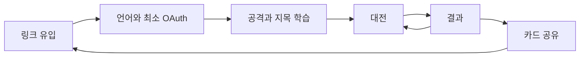

# 04. 고객 여정

> 적용: pm-market-research:customer-journey-map · 입력: [P1](03-segments-personas.md)

| 단계 | 접점 / 행동 | 감정 가설 | 고통 | 개선과 측정 |
|---|---|---|---|---|
| 발견 | 친구 링크·공유 카드 클릭 | 호기심 | 규칙을 모름 | 한 문장 설명; invite_open |
| 판단 | 로컬 언어 랜딩 확인 | 기대 | 로그인 걱정 | 무계정 로컬 연습; landing_view → tutorial_start |
| 입장 | OAuth 최소 로그인·게임 닉네임 | 안도 | CMP가 게임을 막음 | 광고 거부 후에도 시작; account_created |
| 학습 | 30초 봇전, 공격·지목 체험 | 의심→성취 | 숨은 숫자를 믿기 어려움 | 최소 안내, 재학습 가능; tutorial_complete |
| 대전 | 친구 방 또는 빠른 대전 | 긴장 | 10초 이상 대기·끊김 | 봇 표시, 재접속 피드백; match_start |
| 결과 | 승패와 반사 수 확인·재대결 | 기쁨/아쉬움 | 광고가 재대결을 막음 | 광고 실패 시 즉시 진행; rematch_selected |
| 공유 | 데일리 카드 복사 | 자부심 | 민감정보 노출 | 닉네임·시드 없는 카드; share_click |
| 재방문 | 다음 UTC 데일리·친구 링크 | 기대 | 빈 대전 풀 | 오프라인 데일리·봇; D1/D7 |

Aha moment는 첫 **정확한 지목으로 반사되는 순간**이다. 첫 학습 완료, 봇 매칭 수락, 첫 패배 후 재대결이 이탈 판단 지점이다. 혼동과 공정성 불신은 먼저 해결하고, 배너 배치는 검증 이후에 조정한다.

## 결정 사항

초대 링크의 방 정보는 튜토리얼을 거쳐도 유지한다. 튜토리얼은 반복 가능하고, 접근성 설정과 언어 변경은 입장 전에도 가능하다.

## 열린 질문

30초 안에 정확한 지목을 이해하는지는 E1에서 관찰한다.
