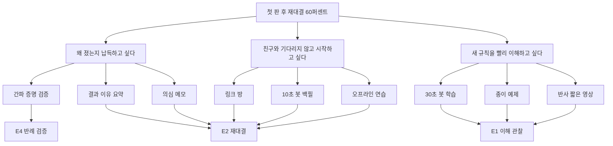

# 12. Opportunity Solution Tree

> 적용: pm-product-discovery:opportunity-solution-tree · 입력: [실험](11-experiments.md)
> 고객 문제는 인터뷰 전 가설이다. 중요도·만족도 수치를 조작하지 않고 정성 순위로 둔다.

결과 목표는 **초기 참여자 10명 중 6명 이상 자발적 재대결**이다. 우선 기회는 패배를 납득하고, 핵심 규칙을 이해하고, 기다리지 않고 플레이하는 것이다.

PM은 결과 요약·링크, 디자이너는 예제·영상·메모, 엔지니어는 증명·봇·오프라인을 제안했다. 하나의 해결책을 가정으로 고정하지 않고 같은 기회에 대해 3개 대안을 비교한다. 주간 인터뷰 결과로 기회와 연결선을 갱신한다.

## 결정 사항

공정성 증명과 학습은 필수이고, 결과 설명의 상세 수준은 관찰로 조정한다.

## 열린 질문

우선순위가 실제 사용자 중요도×(1−만족도) 조사에서도 유지되는지 확인한다.
